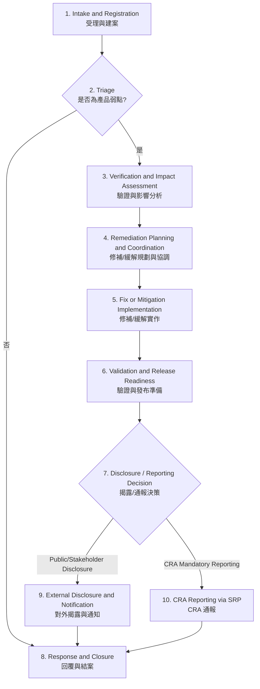

# L2-01：弱點處理與揭露程序 Vulnerability Handling and Disclosure Process

- **文件屬性**：程序（Level 2）
- **適用標準**：ISO/IEC 29147:2018、ISO/IEC 30111:2019、CRA（Regulation (EU) 2024/2847）相關要求
- **版本**：v0.1（草案）
- **文件擁有者**：IEI PSIRT
- **相關文件**：
  - 產品安全事件管理程序
  - 產品安全更新管理程序
  - 弱點通報受理、ACK 與對外溝通作業文件
  - 弱點分流、分析、Jira 管理、揭露與公告等下階作業文件

## 1. 目的 Purpose

建立 IEI 產品弱點受理、驗證、分析、修補、揭露、通報與結案之統一流程，確保：

- 對外弱點揭露與通報機制符合 ISO/IEC 29147 之精神。
- 內部弱點處理、分派、修補與驗證符合 ISO/IEC 30111 之要求。
- CRA 要求之 coordinated vulnerability disclosure、單一聯絡窗口、修補後公開揭露、SBOM/元件追蹤與強制通報機制可被落實。
- 對研究員、客戶、ODM/OEM 客戶、供應商、協調者與主管機關之溝通具有一致性、可回溯性與可稽核性。
- IEI 使用 Jira 作為案件主追蹤系統，集中保存案件狀態、決策、聯繫摘要與必要證據。

## 2. 範圍 Scope

本程序適用於下列與 IEI 產品或其數位元件相關之弱點案件：

- 外部研究員、客戶、終端使用者、合作夥伴、CERT/CSIRT 或供應商之弱點通報。
- 內部 PM、RD、DQV/QA、測試、客服、業務或其他單位發現之產品安全弱點。
- 影響 IEI 標準產品、ODM/OEM 客製產品、韌體、BIOS/UEFI、driver、軟體套件、雲端配套元件或第三方相依元件之弱點。
- 已公開弱點、疑似遭利用弱點、已遭主動利用弱點，以及影響產品數位安全之嚴重事件。

本程序不取代一般 IT 事故處理程序；若案件涉及企業內部 IT 環境而非產品本身，應轉依適用之資訊安全事件程序辦理。

## 3. 程序原則 Governing Principles

1. **單一窗口**
   對外之弱點受理與協調揭露由 PSIRT 統一窗口處理，避免重複承諾或口徑不一致。
2. **最小必要揭露**
   在修補或風險控制完成前，僅共享完成驗證、修補、通知與法遵所需之最小資訊，避免過早揭露可武器化細節。
3. **產品導向影響評估**
   弱點分析須識別受影響之 product family、型號、平台、BOM variant、軟體/韌體版本與支援狀態，不能僅停留在 CVE 或元件名稱層級。
4. **供應鏈協調**
   涉及第三方元件、上游供應商、ODM/OEM 客戶或品牌客戶時，應啟動受控協調流程。
5. **風險導向處理**
   依 CVSS、可利用性、是否已有 exploit、受影響產品數量、營運或安全衝擊、可替代緩解措施等因素決定處理優先序。
6. **Jira 留痕**
   所有關鍵判定、核准、例外、對外溝通摘要與證據連結均應記錄於 Jira 主案件中。
7. **法遵優先**
   若案件同時觸發 CRA 或其他法定通報義務，法定時限優先於一般弱點處理目標。

## 4. 名詞 Definitions

### 4.1 弱點案件 Vulnerability Case

指任何已通報、已識別或已驗證，可能影響 IEI 產品機密性、完整性、可用性、真實性或安全防護機制之弱點、缺陷或相關安全議題。

### 4.2 協調式弱點揭露 CVD

指於控制風險之前提下，由 PSIRT 協調研究員、客戶、供應商、CERT/CSIRT 或其他利害關係人之揭露、修補與公告活動。

### 4.3 已遭主動利用弱點 Actively Exploited Vulnerability

指已有可信證據顯示弱點正遭惡意利用之案件，屬 CRA 強制通報判定重點之一。

以下指標將觸發處理程序：

- **指標 A（外部）**：在 VirusTotal、CISA KEV 或 GreyNoise 上發現漏洞被利用的證據，屬於嚴重事件威脅，需立即排查內部是否受害。
- **指標 B（內部）**：內部系統 Log、EDR 或產品遙測數據顯示有未經授權的存取、竄改或資料外流，即屬「已遭惡意入侵的痕跡」，直接觸發嚴重事件通報。

### 4.4 嚴重事件 Severe Incident

指對產品之數位安全造成重大不利影響之事件，可能涉及可用性、真實性、完整性或機密性之重大受損，並可能觸發 CRA 強制通報。

### 4.5 支援期間 Support Period

指產品對外宣告之維護支援期間。對 CRA 適用產品，支援期間應符合公開承諾，且原則上不得低於 5 年，除非有合理且可證明之較短預期使用壽命。

### 4.6 Jira 主案件 Master Jira Record

指作為該弱點案件唯一主追蹤紀錄之 Jira issue，用以記錄案件屬性、處理狀態、責任人、時程、溝通摘要、附件與決策結果。

## 5. 角色與利害關係人 Roles and Stakeholders

| 角色 | 主要責任 |
|---|---|
| PCC | 評估風險優先級、決策是否對外揭露與發布公告。關鍵判定、例外、揭露與法遵決策核准 |
| PSIRT | 受理通報、建案、分流、外部溝通、時程控管、揭露治理、CRA 通報協調、結案與度量 |
| PM | 識別產品與客戶範圍、商業影響、ODM/OEM 客戶協調、EOL/EOS 判定 |
| RD | 技術分析、重現、root cause、修補或緩解方案、供應商技術協調 |
| DQV / QA / QT | 驗證修補有效性、回歸測試、相容性與發行證據 |
| 法務 / 法遵 | 合約、揭露風險、主管機關通報、個資與跨境資料處理審查 |
| 業務 / 客服 | 客戶分層通知、客戶回饋蒐集、商務溝通支援 |
| IT / Jira 管理者 | Jira 權限、保存、稽核與系統可用性維持 |
| 外部研究員 / 客戶 / 供應商 / CERT / CSIRT | 弱點提供、協調揭露、補件、交互驗證與同步溝通 |

## 6. 程序總覽 Process Overview

## 7. 流程要求 Process Requirements

### 7.1 受理與建案 Intake and Registration

1. IEI 應維持至少一個公開單一聯絡窗口，供研究員、客戶、供應商與協調者回報弱點。
2. 目前已知公開入口至少包括 `security@ieiworld.com`、PGP 加密通報機制，以及公開公告頁面 `https://www.ieiworld.com/security-advisories`；若有網站表單、`security.txt`、portal 或 bug bounty 入口，應一併納入同一管理範圍。
3. 收到通報後，PSIRT 應立即建立 Jira 主案件，至少記錄：
   - 收件時間與來源
   - 通報者識別與聯絡方式
   - 受影響產品/版本/平台
   - 弱點描述、PoC、附件與公開狀態
   - 是否疑似遭利用、是否可能涉及 CRA
   - 敏感度與存取權限分級
4. 若案件由業務、客服或其他非 PSIRT 單位先收到，該單位應於同一工作日內轉交 PSIRT，不得自行對外承諾處理結果。

### 7.2 初步回覆與受理判定 Initial Response and Acceptance

1. 對外通報案件應提供案件識別碼與受理確認。
2. 依 IEI 現行公開政策，外部回報後之對外節點至少應包含：
   - 系統自動回覆案件編號：收到時立即提供，若通報管道具備自動回覆功能。
   - 啟動分析：自收件日起 7 日內。
   - 確認是否受理：自啟動分析日起 14 日內。
   - 若要求補件，時程得自補件完成日重新起算。
3. 若通報管道無自動回覆機制，PSIRT 應於 3 個工作日內以人工方式完成最小 ACK。
4. 不受理案件應說明原因，例如：
   - 非 IEI 產品或非支援範圍
   - 無法驗證且關鍵資訊不足
   - 純一般品質瑕疵且不涉及安全屬性
   - 重複案件且無新增有效資訊

### 7.3 驗證與影響分析 Verification and Impact Assessment

1. PSIRT 與 RD/DQV 應確認案件是否可重現、是否影響產品安全以及是否存在合理攻擊情境。
2. 影響分析至少應涵蓋：
   - 受影響 product family、型號、版本、平台與 BOM variant
   - 是否涉及第三方元件、供應商公告、既有 CVE 或上游修補
   - 軟體與韌體元件盤點結果，必要時對應至 SBOM
   - CVSS 分數與風險等級（Low / Medium / High / Critical）
   - 是否已有公開 exploit、在野利用、已知攻擊活動
   - 量產、在場、已交付、ODM/OEM 客戶與關鍵產業別之影響
   - 是否屬 EOS/EOL 或支援期內產品
3. 若案件涉及第三方元件，應同步建立供應商協調子任務，並保留上游公告、patch ETA、workaround 與相依條件之記錄。
4. 若案件可對產品造成重大安全衝擊或疑似已遭利用，PSIRT 應立即升級為高優先案件，不受一般分析排程限制。

### 7.4 修補或緩解規劃 Remediation and Mitigation Planning

1. RD 應提出修補、緩解、營運控制或風險接受建議，交由 PSIRT 與相關利害關係人審查。
2. 可接受之處置方式包含但不限於：
   - 正式 security patch、BIOS/UEFI/firmware/driver/software update
   - 上游供應商 patch 或 microcode 整合
   - 組態調整、功能停用、ACL、防火牆規則、網段隔離等緩解措施
   - 對 EOS/EOL 或高風險高成本情況提供 best effort 指引
3. 規劃時應同時確認：
   - 修補目標時程
   - 驗證範圍與發布條件
   - 客戶通知策略
   - OEM/ODM 是否需預先通知或採聯合公告
   - 是否需要 CVE 申請、CNA 協調或主管機關通報
4. IEI PSIRT 應建立 CVE 管理能力，並以 **2026 年第 3 季取得 CNA 能力** 為規劃目標；在正式取得 CNA 資格前，`IEI PSIRT` 為對外 CVE 申請、追蹤與協調責任人。

### 7.5 修補時程基準 Remediation Timing Baseline

依 IEI 現行公開政策，修補規劃之對外預估基準如下：

- `Critical / High`：30 至 90 天內完成修補或有效緩解方案。
- `Medium`：3 至 6 個月或併入下一重大版本。
- `Low`：依產品生命週期與維護計畫排程，可併入例行維護。

若案件涉及已遭利用、重大客戶風險、法規義務或大量已部署產品，PCC 得要求縮短時程，並以 workaround 先行。

### 7.6 驗證、發布與交付 Validation, Release and Delivery

1. 所有修補或緩解措施在對外發布前，應經 DQV/QA/QT 驗證其：
   - 已解決預期弱點或有效降低風險
   - 不造成不可接受之回歸、法規衝突或關鍵功能失效
   - 與受影響產品版本、相依元件與支援情境相容
2. 如需發布安全更新，應依安全更新管理程序辦理，並提供安裝、驗證與回復說明。
3. 技術可行時，安全更新應與一般功能更新分開交付，以降低使用者套用與驗證複雜度。
4. 交付之更新檔案應具完整性與真實性保護機制，例如雜湊、數位簽章或等效驗證方式。

### 7.7 揭露與通知決策 Disclosure and Notification Decision

1. 原則上，IEI 應於修補程式或有效緩解措施可用後，對外揭露 fixed vulnerability 資訊。
2. 若弱點已廣泛知悉、疑似遭利用、法規要求加速揭露，或延遲揭露之風險高於提前通知之風險，PSIRT 得提出提前公告與暫時性建議。
3. Medium/Low 弱點得於完整解決方案就緒後採整合式公告。
4. 對於 ODM/OEM 客製專案，應先依合約與客戶責任分工確認：
   - 由 IEI 公開公告
   - 由客戶自行公告
   - 採聯合或同步公告
5. 若客戶選擇不實施修補，IEI 應保留風險告知與溝通紀錄。
6. 對 CRA 適用產品，若製造商判定立即公開 fixed vulnerability 資訊之風險高於利益，得在有正當理由下延後公開，直至使用者有合理機會套用修補。
7. 若案件需公開 CVE 識別碼，於 IEI PSIRT 取得 CNA 資格前，應透過既有合作窗口或外部 CNA 辦理；取得 CNA 資格後，應改依 IEI 內部 CNA 作業流程分配、審查與發布。

### 7.8 CRA 強制通報 CRA Mandatory Reporting

1. CRA Article 14 通報義務自 **2026 年 9 月 11 日**起適用；CRA 其餘核心弱點處理要求原則上自 **2027 年 12 月 11 日**起全面適用。若 IEI 知悉以下情形，應啟動 CRA 通報流程：
   - 已遭主動利用弱點
   - 對產品數位安全造成重大影響之嚴重事件
2. CRA 通報應透過 ENISA 建置之 Single Reporting Platform（SRP）辦理，並由 PSIRT 主責，法遵/法務支援。
3. 時限如下：
   - `24 小時內`：early warning
   - `72 小時內`：正式通知與初步評估
   - `最終報告`：
     - 已遭主動利用弱點：於 corrective measure 可用後 14 日內
     - 嚴重事件：自初始通知起 1 個月內
4. 為滿足前述時限，PSIRT 應於內部建立同日升級機制；凡疑似觸發 CRA 者，案件建立後應立即通知 PCC、法遵/法務與相關主管。
5. 若 IEI 在 EU 之主要設立地、授權代表或 CSIRT 對口尚未明確，應於程序正式生效前完成指定。

### 7.9 結案與持續改善 Closure and Continuous Improvement

1. 案件結案前，PSIRT 應確認：
   - 技術處置已完成或有正式風險接受決議
   - 研究員、客戶、供應商與其他應通知對象已完成必要溝通
   - Jira 記錄、附件、決策、公告與通知證據完整
   - 後續追蹤事項已移轉至維護或產品路線圖
2. SPMO 或指定治理單位應定期召集 PSIRT 檢討案件處理成效、瓶頸與改善措施。

## 8. 對外溝通政策 External Communication Policy

### 8.1 對外窗口與通道

- 主要通報窗口：`security@ieiworld.com`
- 加密方式：PGP 或經核准之等效保密機制
- 公開公告頁面：`https://www.ieiworld.com/security-advisories`
- 其他可能通道：網站表單、`/.well-known/security.txt`、bug bounty 平台、客服轉件、供應商通報、CERT/CSIRT 協調

### 8.2 時限政策

| 對象/階段 | 時限 | 說明 |
|---|---|---|
| 自動案件編號回覆 | 即時 | 適用於具自動回覆之正式通道 |
| 人工 ACK | 3 個工作日內 | 通道無自動回覆時適用 |
| 啟動分析 | 收件後 7 日內 | 依 IEI 現行公開政策 |
| 是否受理通知 | 啟動分析後 14 日內 | 可為受理、不受理或補件 |
| 高風險案件狀態更新 | 至少每 7 日一次 | 直到修補或暫時緩解就緒 |
| 其他案件狀態更新 | 重大里程碑或最長 30 日一次 | 避免通報人失聯或誤判狀態 |
| CRA 早期警示 | 知悉後 24 小時內 | 僅適用 CRA 強制通報案件 |
| CRA 正式通知 | 知悉後 72 小時內 | 僅適用 CRA 強制通報案件 |

### 8.3 對外訊息最小內容

#### A. 對研究員或通報者

- 案件識別碼
- 是否已受理或需補件
- 下一次更新時點
- 保密與協調揭露提醒
- 必要時之致謝、認列或 bounty 流程資訊

#### B. 對受影響客戶或 ODM/OEM 客戶

- 受影響產品/版本/條件
- 風險摘要與嚴重度
- 可用修補、workaround 或營運建議
- 更新套用方式與注意事項
- 若尚未有修補，應提供暫行性風險降低措施與下一次更新節點

#### C. 對供應商、合作夥伴或協調者

- 完成協調所需之最小必要技術資訊
- 時程、保密要求與同步公告規則
- 受影響範圍與交付依賴

#### D. 對公眾公告

至少應包含：

- 弱點描述
- 受影響產品與版本識別資訊
- 影響與嚴重度
- CVE 或其他識別碼（如有）
- 修補/更新/緩解措施
- 安裝與驗證方式摘要
- EOS/EOL 或不適用條件

### 8.4 禁止過早揭露內容

在未完成風險控管前，不得對外主動揭露：

- 完整 exploit code、payload、關鍵參數或可直接複製之攻擊鏈
- 尚未發布修補前足以導致 N-day weaponization 的差異細節
- 不必要之客戶環境資訊、個資或敏感營運資料

## 9. 利害關係人管理 Stakeholder Management

PSIRT 應於每一弱點案件中建立或更新利害關係人清單，至少識別：

- 通報者或研究員
- 受影響客戶與 ODM/OEM 客戶
- PM、RD、DQV/QA、客服、業務
- 第三方元件供應商與外包合作夥伴
- 必要時之 CERT/CSIRT、CVE/CNA、主管機關或法遵窗口

針對 OEM/ODM 案件，應額外記錄公告權責、通知順序、NDA 條件與客戶是否自行發布。

## 10. Jira 記錄與資料保護 Jira Recordkeeping and Data Protection

### 10.1 必填紀錄

每一 Jira 主案件至少應記錄：

- 案件編號、來源、建立時間、目前狀態與責任人
- 產品、版本、平台、BOM/第三方元件資訊
- 風險等級、CVSS、是否疑似已遭利用
- 分析結論、修補/緩解方案、發布決策
- 對外溝通摘要、通知日期、主要承諾與例外
- 公告版本、修補版本、結案日期與 lessons learned

### 10.2 附件與敏感資料

1. Jira 得保存與案件有關之郵件內容、截圖、客戶帳號資訊與其他證據，但須依 need-to-know 原則限制存取。
2. 涉及個資、客戶聯絡方式、弱點細節或未公開修補資訊之附件，應使用適當權限群組與敏感度標記。
3. 個資資料應依 GDPR 原則處理，包括合法性、公平性與透明性、目的限制、資料最小化、正確性、保存限制、完整性與機密性，以及可課責性；非案件處理、法遵或稽核所必要之個資，不得蒐集、保存或對外分享。
4. 若資料需轉出 Jira，應保留匯出紀錄、目的說明、接收對象、保護措施與法遵審查結果。

### 10.3 保留與稽核

Jira 紀錄、公告與關鍵溝通證據應依公司紀錄保存政策、法遵要求與本程序保存年限留存；若其他適用政策或合約要求較長保存期間，應從其較長者。

### 10.4 Jira 資料保存政策

1. CRA 相關案件之 Jira 主案件、子任務、關鍵決策、對外通知紀錄、公告證據、修補或緩解證據、稽核紀錄與必要附件，應自案件結案日起至少保存 10 年；若適用法規、合約、客戶要求或訴訟保存要求訂有較長期間，應從其較長者。
2. 非 CRA 相關案件應依風險與資料敏感度分級保存：Critical / High 弱點案件自結案日起至少保存 5 年；Medium / Low 弱點案件自結案日起至少保存 3 年；誤報、非 IEI 產品、不可重現或不受理案件自結案日起至少保存 1 年。
3. 若非 CRA 案件涉及合約、客戶爭議、客訴、法務保存要求、稽核待辦或其他法定義務，應依較長期間保存；legal hold 期間不得刪除、封存或去識別化可能影響證據完整性之資料。
4. 含個資、客戶聯絡資訊、未公開弱點細節、PoC、攻擊細節、系統截圖或產品遙測資料之附件，應定期檢視其保存必要性；保存目的消失或保存期限屆滿後，應優先刪除原始附件，或改以摘要化、遮罩化、去識別化資料保存。
5. 保存期限屆滿前，PSIRT 與 Jira 管理者應確認案件無重開、未完成公告、客戶爭議、法務 hold 或稽核需求後，依公司資料刪除與銷毀程序刪除、封存或去識別化。
6. Jira 管理者應確保保存期間內資料具備可追溯性、完整性與必要存取紀錄；任何刪除、封存、去識別化、匯出、權限異動或保存例外，均應留下可稽核紀錄，至少包含日期、執行人、核准人、處理範圍與理由。

## 11. 稽核與量測 Audit and Metrics

至少應定期檢視下列指標：

- 首次回覆時間
- 啟動分析時間
- 受理判定時間
- 可重現率與不受理原因分布
- 高風險案件修補完成時間
- 公告發布時間
- 供應商依賴案件比例
- ODM/OEM 協調案件比例
- CRA 通報案件數與通報時限符合率
- 重複通報率與客訴再發率

稽核檢查至少應確認：

1. 是否所有案件皆有 Jira 主案件與關鍵決策紀錄。
2. 是否遵循公開時限與內部升級機制。
3. 是否存在未經核准之過早揭露。
4. 是否能追溯修補、驗證、公告與對外通知之一致性。
5. 是否對 CRA 通報判定與送件留有客觀證據。

## 12. 資訊不足與待確認事項 Context Gaps and Assumptions

依目前提供之脈絡，以下資訊仍不足，已於本草案中以原則性條文或待確認方式處理：

1. **EU 法遵對口資訊不足**
   尚未提供 IEI 在 EU 之主要設立地、authorized representative、指定 CSIRT coordinator 與 SRP 實際送件責任鏈，故 CRA 通報段落僅能先定義流程與時限，無法寫入具名責任單位。
2. **CVE/CNA 能力仍在建置中**
   已知 IEI PSIRT 規劃申請 CNA，目標為 **2026 年第 3 季達標**，且目前由 `IEI PSIRT` 擔任對外 CVE 申請、追蹤與協調責任人；但尚未提供申請進度、內部審查準則與過渡期間之外部 CNA 對接機制，故本文件仍先保留原則性要求。
3. **產品支援政策細節不足**
   已知 EOL/EOS 產品採 best effort，但未提供各產品家族 support period、EOS 公告規則與 CRA 適用產品之最終支援年限，因此支援期間條文仍需正式版補強。
4. **下階文件與表單編號不足**
   目前僅有參考性 L3 文件與顧問程序內容，未提供 IEI 最終採用之表單、欄位、審查會議與例外核准模板，故本 L2 文件未綁定固定表單編號。

## 13. 文件治理與版控 Document Control

| 項目 | 內容 |
|---|---|
| 文件擁有者 | IEI PSIRT |
| 審閱者 | PCC、PSIRT、PM、RD、DQV/QA、法遵/法務、業務/客服代表 |
| 生效條件 | 完成跨部門審閱與管理階層核准後生效 |
| 修訂觸發 | 法規更新、重大事件教訓、支援政策調整、組織異動、稽核缺失改善 |
| 一致性要求 | 應與公開漏洞披露政策、產品安全事件管理程序、產品安全更新管理程序及下階作業文件一致 |

## 14. 修訂紀錄 Revision History

| 版本 | 日期 | 修訂摘要 | 修訂者 | 審閱者 | 核准者 |
|---|---|---|---|---|---|
| v0.1 | 2026-04-19 | 依 IEI 既有公開政策、CRA、ISO/IEC 29147 與 ISO/IEC 30111 草擬 L2 弱點處理與揭露程序；納入 Jira 留痕、CRA 通報、OEM/ODM 協調與資訊缺口分析 | Stanley Huang |  |  |
