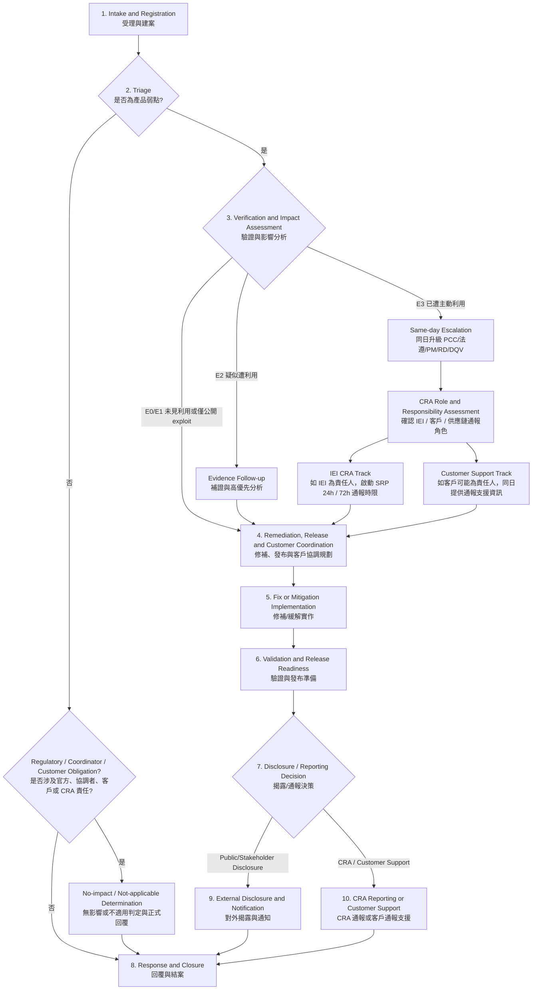

# L2-01：弱點處理與揭露程序 Vulnerability Handling and Disclosure Process

- **文件屬性**：程序（Level 2）
- **適用標準**：ISO/IEC 29147:2018、ISO/IEC 30111:2019、prEN 40000-1-3:2026 draft、CRA（Regulation (EU) 2024/2847）相關要求
- **版本**：v1.1
- **修訂者**：Stanley Huang
- **文件擁有者**：IEI PSIRT

## 1. 目的 Purpose

建立 IEI 產品弱點受理、驗證、分析、修補、揭露、通報與結案之統一流程，確保：

- 對外弱點揭露與通報機制符合 ISO/IEC 29147 之精神。
- 內部弱點處理、分派、修補與驗證符合 ISO/IEC 30111 之要求。
- 建立可對應 prEN 40000-1-3 vulnerability handling 要求之程序、紀錄與證據。
- CRA 要求之 coordinated vulnerability disclosure、單一聯絡窗口、修補後公開揭露、SBOM/元件追蹤與強制通報機制可被落實。
- 對研究員、客戶、ODM/OEM 客戶、供應商、協調者與主管機關之溝通具有一致性、可回溯性與可稽核性。
- IEI 使用 Jira 作為案件主追蹤系統，集中保存案件狀態、決策、聯繫摘要與必要證據。

## 2. 適用範圍 Applicable Scope

本程序適用於下列與 IEI 產品或其數位元件相關之弱點案件：

- 外部研究員、客戶、終端使用者、合作夥伴、CERT/CSIRT 或供應商之弱點通報。
- 內部 PM、RD、DQV/QA、測試、客服、業務或其他單位發現之產品安全弱點。
- 影響 IEI 標準產品、ODM/OEM 客製產品、韌體、BIOS/UEFI、driver、軟體套件、雲端配套元件或第三方相依元件之弱點。
- 已公開弱點、疑似遭利用弱點、已遭主動利用弱點，以及影響產品數位安全之嚴重事件。

本程序不取代一般 IT 事故處理程序；若案件涉及企業內部 IT 環境而非產品本身，應轉依適用之資訊安全事件程序辦理。

### 2.1 適用性與風險式加嚴要求 Applicability and Risk-based Enhancements

PSIRT 應依產品情境、產品風險評估、支援期間、部署規模、預期使用環境、法規適用性與可能社會影響，判定本程序及相關下階作業文件之適用程度。

若產品風險評估顯示需採取較高嚴謹度，應於產品或案件紀錄中保留加嚴要求之適用性判定。加嚴要求可包含但不限於安全通訊、SBOM 完整性、軟體元件 hash、machine-readable advisory、較高頻率之監控、測試、審查與客戶通知。

## 3. 組織與責任 Organization and Responsibility

### 3.1 角色與責任 Roles and Responsibilities

| 角色 | 主要責任 |
|---|---|
| PCC | 評估風險優先級、決策是否對外揭露與發布公告。關鍵判定、例外、揭露與法遵決策核准 |
| PSIRT | 受理通報、建案、分流、外部溝通、時程控管、揭露治理、CRA 通報協調、結案與度量 |
| PM | 提供產品範圍、版本、BOM variant、支援狀態、EOL/EOS、客戶部署、ODM/OEM 權責、商業與合約影響、release path 與客戶通知策略輸入；協助修補規劃、發布交付與結案後產品改善追蹤。 |
| RD | 技術分析、重現、root cause、修補或緩解方案、供應商技術協調 |
| DQV / QA / QT | 驗證修補有效性、回歸測試、相容性與發行證據 |
| 法務 / 法遵 | 合約、揭露風險、主管機關通報、個資與跨境資料處理審查 |
| 業務 / 客服 | 客戶分層通知、客戶回饋蒐集、商務溝通支援 |
| IT / Jira 管理者 | Jira 權限、保存、稽核與系統可用性維持 |
| 外部研究員 / 客戶 / 供應商 / CERT / CSIRT | 弱點提供、協調揭露、補件、交互驗證與同步溝通 |

### 3.2 利害關係人管理 Stakeholder Management

PSIRT 應於每一弱點案件中建立或更新利害關係人清單，至少識別：

- 通報者或研究員
- 受影響客戶與 ODM/OEM 客戶
- PM、RD、DQV/QA、客服、業務
- 第三方元件供應商與外包合作夥伴
- 必要時之 CERT/CSIRT、CVE/CNA、主管機關或法遵窗口

針對 OEM/ODM 案件，應額外記錄公告權責、通知順序、NDA 條件與客戶是否自行發布。

## 4. 定義 Definitions

### 4.1 弱點案件 Vulnerability Case

指任何已通報、已識別或已驗證，可能影響 IEI 產品機密性、完整性、可用性、真實性或安全防護機制之弱點、缺陷或相關安全議題。

### 4.2 協調式弱點揭露 CVD

指於控制風險之前提下，由 PSIRT 協調研究員、客戶、供應商、CERT/CSIRT 或其他利害關係人之揭露、修補與公告活動。

### 4.3 已遭主動利用弱點 Actively Exploited Vulnerability

指已有可靠證據顯示，惡意行為者已在未經系統擁有者許可之情況下，於實際系統中利用該弱點。可靠證據可來自官方機構、上游供應商、PSIRT/CERT/CSIRT、CISA KEV、客戶現場鑑識資料、產品遙測、攻擊 IOC、EDR/XDR 告警、封包或系統日誌等。

單純 CVSS 高分、EPSS 高分、公開 PoC、研究員展示、掃描器命中或網路傳言，不得單獨視為已遭主動利用，但應作為疑似遭利用或高優先處理之風險訊號。此類案件應視為高優先級產品安全事件，並依 CRA Article 14 判定是否啟動強制通報程序。

### 4.4 嚴重事件 Severe Incident

指對產品之數位安全造成重大不利影響之事件，可能涉及可用性、真實性、完整性或機密性之重大受損，並可能觸發 CRA 強制通報。

### 4.5 支援期間 Support Period

指產品對外宣告之維護支援期間。對 CRA 適用產品，支援期間應符合公開承諾，且原則上不得低於 5 年，除非有合理且可證明之較短預期使用壽命。

### 4.6 Jira 主案件 Master Jira Record

指作為該弱點案件唯一主追蹤紀錄之 Jira issue，用以記錄案件屬性、處理狀態、責任人、時程、溝通摘要、附件與決策結果。

## 5. 流程圖 Flow Chart

## 6. 程序 Procedure

### 6.1 程序原則 Governing Principles

1. **單一窗口**
   對外之弱點受理與協調揭露由 PSIRT 統一窗口處理，避免重複承諾或口徑不一致。
2. **最小必要揭露**
   在修補或風險控制完成前，僅共享完成驗證、修補、通知與法遵所需之最小資訊，避免過早揭露可武器化細節。
3. **產品導向影響評估**
   弱點分析須識別受影響之 product family、型號、平台、BOM variant、軟體/韌體版本與支援狀態，不能僅停留在 CVE 或元件名稱層級。
4. **供應鏈協調**
   涉及第三方元件、上游供應商、ODM/OEM 客戶或品牌客戶時，應啟動受控協調流程。
5. **風險導向處理**
   依 CVSS、可利用性、是否已有 exploit、受影響產品數量、營運或安全衝擊、可替代緩解措施等因素決定處理優先序。
6. **Jira 留痕**
   所有關鍵判定、核准、例外、對外溝通摘要與證據連結均應記錄於 Jira 主案件中。
7. **法遵優先**
   若案件同時觸發 CRA 或其他法定通報義務，法定時限優先於一般弱點處理目標。
8. **準備優先**
   弱點處理能力不應僅於案件發生後啟動；產品識別、元件盤點、通報通道、監控來源、定期測試與審查計畫，應於產品支援期間內持續維護。

### 6.2 準備能力 Preparedness Capabilities

為支援弱點受理、影響分析、修補決策、揭露與法規符合性，IEI 應建立並維護下列準備能力：

1. **產品識別能力**
   應能識別 manufacturer name、product name、產品型號、硬體版本、軟體/韌體版本、平台、BOM variant 與支援狀態。若產品同時包含硬體與軟體，應能分別提供硬體與軟體識別資訊。
2. **軟體元件識別與 SBOM 能力**
   支援期間內之適用產品應建立並維護軟體元件清單或 SBOM，以支援第三方元件弱點監控、影響分析、修補範圍判定與稽核證據。SBOM 應採結構化且 machine-readable 格式；具體格式、欄位、產製工具、更新時機與完整性檢查，應於 L3 作業文件定義。
3. **硬體元件識別與 HBOM 能力**
   對可能影響產品資安風險之硬體、韌體、晶片、模組或安全相關元件，應維護可支援弱點影響分析之硬體元件識別資訊。具體欄位、資料來源與維護方式，應於 L3 作業文件定義。
4. **上下游利害關係人映射**
   應維護足以支援協調、通知與法規判定之上游供應商、open source dependency、ODM/OEM 客戶、品牌客戶、進口商、經銷商、授權代表與必要協調窗口資訊。
5. **風險式安全測試與審查計畫**
   支援期間內之產品應依產品風險建立 security test and review plan，規劃定期弱點掃描、元件弱點檢查、供應商公告審查、威脅情報審查、發布後回饋檢討與至少年度之產品資安風險重評。測試項目、頻率、工具、證據格式與例外處理，應於 L3 作業文件或產品資安計畫中定義。
6. **監控來源維護**
   PSIRT 或指定單位應維護弱點監控來源清單，至少涵蓋外部通報、內部測試與審查結果、CVE/NVD、EUVD、CISA KEV、供應商公告、CERT/CSIRT 通報、open source 維護狀態與第三方元件 EOS/usage 風險。

### 6.3 流程要求 Process Requirements

#### 6.3.1 受理與建案 Intake and Registration

1. IEI 應維持至少一個公開單一聯絡窗口，供研究員、客戶、供應商與協調者回報弱點。
2. 目前已知公開入口至少包括 `security@ieiworld.com`、PGP 加密通報機制，以及公開公告頁面 `https://www.ieiworld.com/security-advisories`；若有網站表單、`security.txt`、portal 或 bug bounty 入口，應一併納入同一管理範圍。
3. 對外通報機制應公開且可近用，並應說明聯絡方式、適用範圍、建議通報內容、安全通訊方式、持續溝通方式、致謝或認列原則、揭露協調原則與 embargo 期待。安全通訊機制不得成為拒收弱點通報之理由；若通報者使用較低安全性通道，PSIRT 應先受理並視風險引導其改用適當保密通道。
4. 收到通報後，PSIRT 應立即建立 Jira 主案件，至少記錄：
   - 收件時間與來源
   - 通報者識別與聯絡方式
   - 受影響產品/版本/平台
   - 產品市場角色、ODM/OEM 客戶、品牌客戶與可能之 EU 責任鏈
   - 弱點描述、PoC、附件與公開狀態
   - Exploitation Status 初判、是否可能涉及 CRA
   - 敏感度與存取權限分級
5. 若產品識別、客戶範圍、支援狀態、ODM/OEM 權責或 EU 市場角色於建案時不明確，PSIRT 應通知 PM 提供初步確認；PM 輸入應記錄於 Jira 主案件，並不得延誤必要之回覆、升級或法定通報時限。
6. 若案件由業務、客服或其他非 PSIRT 單位先收到，該單位應於同一工作日內轉交 PSIRT，不得自行對外承諾處理結果。

#### 6.3.2 初步回覆與受理判定 Initial Response and Acceptance

1. 對外通報案件應提供案件識別碼與受理確認。
2. 依 IEI 現行公開政策，外部回報後之對外節點至少應包含：
   - 系統自動回覆案件編號：收到時立即提供，若通報管道具備自動回覆功能。
   - 啟動分析：自收件日起 7 日內。
   - 確認是否受理：自啟動分析日起 14 日內。
   - 若要求補件，時程得自補件完成日重新起算。
3. 若通報管道無自動回覆機制，PSIRT 應於 3 個工作日內以人工方式完成最小回覆。
4. 不受理案件應說明原因，例如：
   - 非 IEI 產品或非支援範圍
   - 無法驗證且關鍵資訊不足
   - 純一般品質瑕疵且不涉及安全屬性
   - 重複案件且無新增有效資訊
5. 若不受理或判定對 IEI 產品無影響之案件來自 ENISA SRP、官方 CERT/CSIRT、協調者、客戶或可能涉及 CRA / 供應鏈責任之來源，PSIRT 不得僅以一般不受理結案，應完成 `Not Affected / Not Applicable` 判定、必要之正式回覆與 Jira 留痕。
6. 當受理或不受理判定涉及產品歸屬、支援狀態、EOL/EOS、客製版本、ODM/OEM 合約責任或客戶品牌權責時，PSIRT 應取得 PM 輸入並記錄於 Jira；若資訊不足但案件具高風險或法定時限，應先依 best available information 處理並持續更新。

#### 6.3.3 驗證與產品影響分析 Verification and Product Impact Assessment

1. PSIRT 與 RD/DQV 應確認案件是否可重現、是否影響產品安全以及是否存在合理攻擊情境。
2. 影響分析至少應涵蓋：
   - 受影響 product family、型號、版本、平台與 BOM variant
   - 是否涉及第三方元件、供應商公告、既有 CVE 或上游修補
   - 軟體與韌體元件盤點結果，必要時對應至 SBOM
   - 硬體、晶片、模組或安全相關元件盤點結果，必要時對應至 HBOM 或等效硬體元件清單
   - 硬體識別資訊與軟體/韌體識別資訊是否可分別支持受影響範圍判定
   - CVSS 分數與風險等級（Low / Medium / High / Critical）
   - 是否已有公開 exploit、在野利用、已知攻擊活動
   - 量產、在場、已交付、ODM/OEM 客戶與關鍵產業別之影響
   - IEI 品牌、ODM/OEM 客製、客戶品牌上市、EU importer/distributor、authorized representative、主要 EU 市場與合約通知義務
   - 是否屬 EOS/EOL 或支援期內產品
3. PM 應於影響分析階段提供產品與客戶影響範圍輸入，至少包含標準品與 ODM/OEM 客製品是否受影響、已出貨或在場產品範圍、銷售與支援狀態、EOL/EOS 判定、重大客戶或關鍵產業客戶、合約通知義務、EU 市場角色與供應鏈責任鏈。RD/DQV 負責技術驗證與測試證據，PSIRT 負責整合安全風險與流程判定。
4. 若案件涉及第三方元件，應同步建立供應商協調子任務，並保留上游公告、patch ETA、workaround 與相依條件之記錄。
5. 若案件可對產品造成重大安全衝擊或疑似已遭利用，PSIRT 應立即升級為高優先案件，不受一般分析排程限制。

#### 6.3.4 已遭利用狀態判定 Exploitation Status Determination

PSIRT 應於弱點受理、驗證與影響分析階段，判定並持續更新案件之利用狀態。判定結果應記錄於 Jira 主案件，並作為優先級、通報、揭露與修補時程之依據。

E0 / E1 / E2 / E3 適用於已確認或合理懷疑影響 IEI 產品之弱點或安全事件。若經查核確認不影響 IEI 產品、非 IEI 產品或不屬 IEI CRA / 供應鏈責任範圍，應標記為 `Not Affected / Not Applicable`，並依來源性質完成必要回覆；不得為了套用 exploitation status 而歸入 E0 / E1 / E2 / E3。

| 等級 | 名稱 | 判定條件 | CRA 通報處理 |
|---|---|---|---|
| E0 | No Evidence 未見利用跡象 | 僅有弱點通報、掃描結果、內部測試或 researcher PoC，無實際攻擊證據 | 不觸發 CRA；依一般弱點流程處理 |
| E1 | Public Exploit Available 有公開 exploit / 可武器化 | 已有公開 PoC、exploit code、Metasploit 模組、GitHub exploit 或可武器化技術細節，但未見實際攻擊證據 | 不直接觸發 CRA；提高優先級並評估縮短修補時程 |
| E2 | Suspected Exploitation 疑似遭利用 | 存在攻擊嘗試、掃描、客戶異常、IOC、產品遙測或威脅情報，但尚未達可靠證據門檻 | 啟動 CRA 預判、補證與法遵會商；不得未經查核即排除 |
| E3 | Confirmed Active Exploitation 已遭主動利用 | 有可靠證據顯示惡意行為者已實際利用該弱點，或該弱點已被 CISA KEV、官方 CERT/CSIRT、上游供應商、外部研究員通報或可信 PSIRT 公告為 exploited in the wild / exploitation detected / active exploitation | 啟動 CRA Article 14 強制通報判定與 24/72 小時計時 |

可直接支持 E3 之可靠證據包含：CISA KEV 收錄、上游或原廠 PSIRT 公告、CERT/CSIRT 官方通報、客戶或現場鑑識證據、產品遙測、攻擊 IOC、EDR/XDR 告警、封包、系統日誌、webshell、惡意 payload、異常帳號建立、命令執行紀錄，且須能合理對應至該弱點或其 exploitation chain。

下列訊號通常應先判定為 E2，經補證後方可升為 E3：大量掃描或攻擊嘗試但未確認成功利用、威脅情報僅稱 likely exploited 且缺乏可驗證細節、客戶回報異常但尚無 log 或 forensic artifact、公開 PoC 出現後產品 telemetry 顯示異常 request pattern 增加、honeypot 觀察到利用嘗試但尚未證明影響 IEI 產品版本。

凡判定為 E3 者，PSIRT 應於同日升級 PCC、法遵/法務、PM、RD 與 DQV/QA，並啟動 CRA Article 14 強制通報判定。若判定為 E2，PSIRT 應要求補充證據、啟動 threat intelligence 查核，並視風險先行規劃 workaround、客戶通知與修補排程。

詳細證據蒐集模板、log/IOC 格式、附件命名、取證保全與逐項查核表應由 L3 作業文件或 Jira 範本定義；本 L2 文件僅規範判定門檻、升級要求與必要留痕。

#### 6.3.5 修補或緩解規劃 Remediation and Mitigation Planning

1. RD 應提出修補、緩解、營運控制或風險接受建議，交由 PSIRT 與相關利害關係人審查。
2. 可接受之處置方式包含但不限於：
   - 正式 security patch、BIOS/UEFI/firmware/driver/software update
   - 上游供應商 patch 或 microcode 整合
   - 組態調整、功能停用、ACL、防火牆規則、網段隔離等緩解措施
   - 對 EOS/EOL 或高風險高成本情況提供 best effort 指引
3. 規劃時應同時確認：
   - 修補目標時程
   - 驗證範圍與發布條件
   - 客戶通知策略
   - OEM/ODM 是否需預先通知或採聯合公告
   - 是否需要 CVE 申請、CNA 協調或主管機關通報
4. 若修復案件於處理期間出現 exploit 活動、CISA KEV 收錄、官方 CERT/CSIRT 緊急通知、客戶實際受害、CRA 觸發訊號、CVSS / EPSS 或產品風險顯著升高，PSIRT 應重新分級並視需要退出批次修復，轉入加速修補、客戶通知或 CRA 通報流程。
5. PM 應就修補規劃提供 release feasibility、版本分支、客戶可套用性、EOL/EOS strategy、ODM/OEM coordination、客戶預通知需求與商業/合約影響輸入；若 PM 輸入與安全風險處置存在衝突，應升級 PCC 或依正式風險接受程序處理。
6. IEI PSIRT 應建立 CVE 管理能力，並以 **2026 年第 3 季取得 CNA 能力** 為規劃目標；在正式取得 CNA 資格前，`IEI PSIRT` 為對外 CVE 申請、追蹤與協調責任人。

#### 6.3.6 修補時程基準 Remediation Timing Baseline

依 IEI 現行公開政策，修補規劃之對外預估基準如下：

- `Critical`：30 至 90 天內完成修補或有效緩解方案。
- `High / Medium`：3 至 6 個月、下一重大版本更新。
- `Low`：依產品生命週期與維護計畫排程，可併入例行維護或批次修復。

若案件涉及已遭利用、重大客戶風險、法規義務或大量已部署產品，PCC 得要求縮短時程，並以 workaround 先行。

#### 6.3.7 驗證、發布與交付 Validation, Release and Delivery

1. 所有修補或緩解措施在對外發布前，應經 DQV/QA/QT 驗證其：
   - 已解決預期弱點或有效降低風險
   - 不造成不可接受之回歸、法規衝突或關鍵功能失效
   - 與受影響產品版本、相依元件與支援情境相容
2. 如需發布安全更新，應依安全更新管理程序辦理，並提供安裝、驗證與回復說明。
3. 除 tailor-made product 與 business user 另有約定外，安全更新應免費提供。
4. 技術可行時，安全更新應與一般功能更新分開交付，以降低使用者套用與驗證複雜度。
5. 交付之更新檔案應具完整性與真實性保護機制，例如雜湊、數位簽章或等效驗證方式。
6. PM 應確認發布策略、交付路徑、客戶適用性、release note 可理解性、客製版本需求與產品生命週期限制；技術驗證通過與否仍應以 RD/DQV/QA/QT 證據為準。

#### 6.3.8 揭露與通知決策 Disclosure and Notification Decision

1. 原則上，IEI 應於修補程式或有效緩解措施可用後，對外揭露 fixed vulnerability 資訊。
2. 若弱點已廣泛知悉、疑似遭利用、法規要求加速揭露，或延遲揭露之風險高於提前通知之風險，PSIRT 得提出提前公告與暫時性建議。
3. Medium/Low 弱點案件得於完整解決方案、維護版本或批次安全更新就緒後採整合式公告；公告仍應清楚列出 CVE、受影響產品 / 版本、修補或緩解方式、發布日期與必要限制。
4. 對於 ODM/OEM 客製專案，應先依合約與客戶責任分工確認：
   - 由 IEI 公開公告
   - 由客戶自行公告
   - 採聯合或同步公告
5. 揭露與通知決策前，PSIRT 應取得 PM 對產品範圍、客戶影響、ODM/OEM 權責、客戶通知順序、合約通知義務與交付可行性之輸入；PM 不應單獨決定是否公開揭露、延後揭露或取代 PCC、PSIRT、法遵/法務之決策權責。
6. 若客戶選擇不實施修補，IEI 應保留風險告知與溝通紀錄。
7. 對 CRA 適用產品，若製造商判定立即公開 fixed vulnerability 資訊之風險高於利益，得在有正當理由下延後公開，直至使用者有合理機會套用修補。
8. 若案件需公開 CVE 識別碼，於 IEI PSIRT 取得 CNA 資格前，應透過既有合作窗口或外部 CNA 辦理；取得 CNA 資格後，應改依 IEI 內部 CNA 作業流程分配、審查與發布。
9. 對外發布 fixed vulnerability 資訊時，應至少提供 human-readable advisory 或等效公告；若產品風險、法規要求、客戶要求或加嚴要求適用，應支援 widely recognized machine-readable advisory 格式。
10. 公開弱點資訊宜視適用性同步至 CVE、EUVD 或其他相關弱點資料庫；若未同步，應於案件紀錄中保留原因。

#### 6.3.9 CRA 強制通報 CRA Mandatory Reporting

1. CRA Article 14 通報義務自 **2026 年 9 月 11 日**起適用；CRA 其餘核心弱點處理要求原則上自 **2027 年 12 月 11 日**起全面適用。若 IEI 知悉以下情形，應啟動 CRA 通報流程：
   - 已遭主動利用弱點
   - 對產品數位安全造成重大影響之嚴重事件
2. 若 IEI 為該產品於 EU 市場之 CRA 第一線通報責任人，通報應透過 ENISA 建置之 Single Reporting Platform（SRP）辦理，並由 PSIRT 主責，法遵/法務支援。
3. 時限如下：
   - `24 小時內`：early warning
   - `72 小時內`：正式通知與初步評估
   - `最終報告`：
     - 已遭主動利用弱點：於 corrective measure 可用後 14 日內
     - 嚴重事件：自初始通知起 1 個月內
4. `CRA Awareness Time` 應以 PSIRT 首次具備可支持 E3 或嚴重事件判定之可靠證據時間為起算參考，並於 Jira 主案件記錄證據來源、判定人、通知時間、責任角色判定與 PCC 決策。
5. 為滿足前述時限，PSIRT 應於內部建立同日升級機制；凡疑似觸發 CRA 者，案件建立後應立即通知 PCC、法遵/法務、PM、業務/客服與相關主管，以確認 IEI、ODM/OEM 客戶、品牌客戶、進口商、經銷商或其他供應鏈角色之通報責任。
6. PM 應於同日協助確認產品是否進入 EU 市場、IEI/ODM/OEM 客戶/品牌客戶/進口商/經銷商之供應鏈角色、客戶通報支援窗口、支援期間與 CRA 適用性；若資訊尚未完整，應先提供已知資訊與不確定性，後續持續更新 Jira 主案件。
7. 若 IEI 不是該產品於 EU 市場之第一線 CRA 通報責任人，但 IEI 合理知悉 ODM/OEM 客戶、品牌客戶、進口商或經銷商可能承擔 CRA Article 14 通報義務，PSIRT 應於同日啟動客戶通報支援流程，提供足以支持客戶 early warning 與 72 小時 notification 之最小必要資訊，包括受影響產品/版本、弱點或事件摘要、Exploitation Status、已知影響、已知緩解措施、資訊敏感度與後續更新時點。
8. E3 或嚴重事件之 IEI SRP 通報或客戶通報支援，不得因等待 PM 完整資訊、PCC 完整會議、修補/緩解規劃完成、公告草稿定稿或對外揭露策略確認而延後。
9. 若 ENISA SRP、官方 CERT/CSIRT、協調者或客戶通報之案件經查核確認不影響 IEI 產品、非 IEI 產品或不屬 IEI CRA / 供應鏈責任範圍，PSIRT 應在法遵/法務支援下，依案件來源與平台機制，透過 SRP、designated CSIRT coordinator、ENISA 或原官方/協調者窗口完成 no-impact / not-applicable 回覆。回覆至少應說明已完成查核、目前未識別出受影響 IEI 產品、目前不觸發 IEI CRA Article 14 通報義務，並保留後續取得新證據時重新評估與更新之空間。此類回覆不等同於 IEI 主動 CRA Article 14 通報，但應作為 CRA 相關案件留痕保存。
10. 若 IEI 在 EU 之主要設立地、授權代表或 CSIRT 對口尚未明確，應於程序正式生效前完成指定；ODM/OEM 或客戶品牌案件亦應於 L3 或客戶清單中維護必要之客戶法遵、PSIRT 或安全通報窗口。

#### 6.3.10 結案與持續改善 Closure and Continuous Improvement

1. 案件結案前，PSIRT 應確認：
   - 技術處置已完成或有正式風險接受決議
   - 研究員、客戶、供應商與其他應通知對象已完成必要溝通
   - Jira 記錄、附件、決策、公告與通知證據完整
   - 後續追蹤事項已移轉至維護或產品路線圖
2. 修補或緩解措施發布後，PSIRT 應依風險執行 post-release remediation monitoring，追蹤更新分發狀態、客戶套用問題、修補失敗、相容性問題、再發通報、攻擊活動變化與是否需要再公告或補充通知。
3. SPMO 或指定治理單位應定期召集 PSIRT 檢討案件處理成效、瓶頸與改善措施。
4. 若結案後仍有產品改善、版本維護、EOL/EOS 調整、客戶承諾、下一版修補或安全需求事項，PM 應負責追蹤其納入產品 roadmap、維護計畫或正式風險接受紀錄。

### 6.4 對外溝通政策 External Communication Policy

#### 6.4.1 對外窗口與通道

- 主要通報窗口：`security@ieiworld.com`
- 加密方式：PGP 或經核准之等效保密機制
- 公開公告頁面：`https://www.ieiworld.com/security-advisories`
- 其他可能通道：網站表單、`/.well-known/security.txt`、bug bounty 平台、客服轉件、供應商通報、CERT/CSIRT 協調

#### 6.4.2 時限政策

| 對象/階段 | 時限 | 說明 |
|---|---|---|
| 自動案件編號回覆 | 即時 | 適用於具自動回覆之正式通道 |
| 人工回覆 | 3 個工作日內 | 通道無自動回覆時適用 |
| 啟動分析 | 收件後 7 日內 | 依 IEI 現行公開政策 |
| 是否受理通知 | 啟動分析後 14 日內 | 可為受理、不受理或補件 |
| 適用於 CRA / 已知遭利用 / 安全或營運高衝擊案件（即 E3/E2 事件） | 收件確認：24 小時內，初步分流 / 可重現性判斷：1 至 3 個工作日，狀態更新：每 1 至 3 個工作日一次 | 直到修補或暫時緩解就緒 |
| Critical 案件狀態更新 | 收件確認：1 個工作日內，初步判斷：3 至 5 個工作日，狀態更新：每 5 個工作日一次 | 直到修補或暫時緩解就緒 |
| 其他案件狀態更新 | 收件確認：3 個工作日內，初步判斷：5 個工作日，狀態更新：依修復計畫回報 | 避免通報人失聯或誤判狀態 |

#### 6.4.3 對外訊息最小內容

#### A. 對研究員或通報者

- 案件識別碼
- 是否已受理或需補件
- 下一次更新時點
- 保密與協調揭露提醒
- 必要時之致謝、認列或 bounty 流程資訊

#### B. 對受影響客戶或 ODM/OEM 客戶

- 受影響產品/版本/條件
- 風險摘要與嚴重度
- 可用修補、workaround 或營運建議
- 更新套用方式與注意事項
- 若尚未有修補，應提供暫行性風險降低措施與下一次更新節點

#### C. 對供應商、合作夥伴或協調者

- 完成協調所需之最小必要技術資訊
- 時程、保密要求與同步公告規則
- 受影響範圍與交付依賴

#### D. 對公眾公告

至少應包含：

- 弱點描述
- 受影響產品與版本識別資訊
- 影響與嚴重度
- CVE 或其他識別碼（如有）
- 修補/更新/緩解措施
- 安裝與驗證方式摘要
- EOS/EOL 或不適用條件
- 公告發布日期與更新日期

對外公告應以 human-readable 格式提供。若適用 machine-readable advisory，應由 L3 作業文件定義格式、產製、審查、發布、更新與撤回流程。

#### 6.4.4 禁止過早揭露內容

在未完成風險控管前，不得對外主動揭露：

- 完整 exploit code、payload、關鍵參數或可直接複製之攻擊鏈
- 尚未發布修補前足以導致 N-day weaponization 的差異細節
- 不必要之客戶環境資訊、個資或敏感營運資料

### 6.5 Jira 記錄與資料保護 Jira Recordkeeping and Data Protection

#### 6.5.1 必填紀錄

每一 Jira 主案件至少應記錄：

- 案件編號、來源、建立時間、目前狀態與責任人
- 產品、版本、平台、BOM/第三方元件資訊
- PM、產品範圍確認時間、客戶/ODM/OEM 影響範圍、EOL/EOS 判定、release path 與客戶通知策略輸入
- 風險等級、CVSS、Exploitation Status、是否可能觸發 CRA、CRA 責任角色初判
- 分析結論、修補/緩解方案、發布決策
- 對外溝通摘要、客戶通報支援紀錄、通知日期、主要承諾與例外
- 公告版本、修補版本、結案日期與 lessons learned

#### 6.5.2 已遭利用與 CRA 判定留痕要求

為使已遭利用狀態與 CRA 通報判定可稽核，Jira 主案件應保留足以重建判定過程之最低必要紀錄。紀錄內容至少應涵蓋：

- 利用狀態判定結果與更新時間。
- 判定理由與適用之 E0 / E1 / E2 / E3 等級。
- 證據來源、證據摘要、證據信心水準與必要附件位置。
- 是否為 CRA 觸發候選案件，以及 CRA awareness time 之起算依據。
- IEI、ODM/OEM 客戶、品牌客戶、進口商、經銷商或其他供應鏈角色之通報責任判定。
- PM 對產品範圍、客戶影響、支援狀態、EOL/EOS、release path、EU 市場角色與客戶通報支援之輸入、時間與不確定性。
- 客戶通報支援資訊之提供時間、接收窗口、資訊範圍、敏感度限制與後續更新承諾。
- 法遵/法務審查狀態、PCC 決策、升級通知時間與相關責任人。
- 對外揭露限制、延後揭露理由、NDA 或 coordinated disclosure 條件。

若案件判定為 E2 或 E3，PSIRT 應於 Jira 主案件中記錄判定理由、證據來源、證據信心水準、升級通知時間、法遵會商狀態與 PCC 決策。證據摘要應採摘要化與最小必要原則；可直接重現攻擊之 exploit 細節、payload、客戶環境敏感資訊或未公開修補差異，應放入受限附件或改由 L3 作業規範指定之保護位置保存。

具體 Jira 欄位名稱、選項值、必填條件、權限群組、workflow、畫面配置與填寫範例，應由 L3 作業文件、Jira 管理設定文件或案件範本定義；本 L2 文件僅規範程序層級之留痕要求。

#### 6.5.3 附件與敏感資料

1. Jira 得保存與案件有關之郵件內容、截圖、客戶帳號資訊與其他證據，但須依 need-to-know 原則限制存取。
2. 涉及個資、客戶聯絡方式、弱點細節或未公開修補資訊之附件，應使用適當權限群組與敏感度標記。
3. 個資資料應依 GDPR 原則處理，包括合法性、公平性與透明性、目的限制、資料最小化、正確性、保存限制、完整性與機密性，以及可課責性；非案件處理、法遵或稽核所必要之個資，不得蒐集、保存或對外分享。
4. 若資料需轉出 Jira，應保留匯出紀錄、目的說明、接收對象、保護措施與法遵審查結果。

#### 6.5.4 保留與稽核

Jira 紀錄、公告與關鍵溝通證據應依公司紀錄保存政策、法遵要求與本程序保存年限留存；若其他適用政策或合約要求較長保存期間，應從其較長者。

#### 6.5.5 Jira 資料保存政策

1. CRA 相關案件之 Jira 主案件、子任務、關鍵決策、對外通知紀錄、公告證據、修補或緩解證據、稽核紀錄與必要附件，應自案件結案日起至少保存 10 年；若適用法規、合約、客戶要求或訴訟保存要求訂有較長期間，應從其較長者。
2. 非 CRA 相關案件應依風險與資料敏感度分級保存：Critical / High 弱點案件自結案日起至少保存 5 年；Medium / Low 弱點案件自結案日起至少保存 3 年；誤報、非 IEI 產品、不可重現或不受理案件自結案日起至少保存 1 年。
3. 若非 CRA 案件涉及合約、客戶爭議、客訴、法務保存要求、稽核待辦或其他法定義務，應依較長期間保存；legal hold 期間不得刪除、封存或去識別化可能影響證據完整性之資料。
4. 含個資、客戶聯絡資訊、未公開弱點細節、PoC、攻擊細節、系統截圖或產品遙測資料之附件，應定期檢視其保存必要性；保存目的消失或保存期限屆滿後，應優先刪除原始附件，或改以摘要化、遮罩化、去識別化資料保存。
5. 保存期限屆滿前，PSIRT 與 Jira 管理者應確認案件無重開、未完成公告、客戶爭議、法務 hold 或稽核需求後，依公司資料刪除與銷毀程序刪除、封存或去識別化。
6. Jira 管理者應確保保存期間內資料具備可追溯性、完整性與必要存取紀錄；任何刪除、封存、去識別化、匯出、權限異動或保存例外，均應留下可稽核紀錄，至少包含日期、執行人、核准人、處理範圍與理由。

### 6.6 稽核與量測 Audit and Metrics

至少應定期檢視下列指標：

- 首次回覆時間
- 啟動分析時間
- 受理判定時間
- 可重現率與不受理原因分布
- SBOM/HBOM 可用性與完整性例外數
- 定期 security test/review plan 執行率
- 年度產品資安風險重評完成率
- 監控來源涵蓋率與監控發現轉案率
- 高風險案件修補完成時間
- 安全更新分發與套用問題回報
- 公告發布時間
- machine-readable advisory 適用案件發布率
- CVE/EUVD 或其他弱點資料庫同步狀態
- 供應商依賴案件比例
- ODM/OEM 協調案件比例
- 產品範圍確認時間、客戶/ODM/OEM 影響範圍確認時間與 EOL/EOS 判定完成率
- 修補發布路徑確認時間與結案後產品改善事項轉入 roadmap 比率
- E2 / E3 案件數、補證完成時間與 E3 升級時間
- CRA 通報案件數與通報時限符合率
- 重複通報率與客訴再發率

稽核檢查至少應確認：

1. 是否所有案件皆有 Jira 主案件與關鍵決策紀錄。
2. 是否遵循公開時限與內部升級機制。
3. 是否存在未經核准之過早揭露。
4. 是否能追溯修補、驗證、公告與對外通知之一致性。
5. 是否對 Exploitation Status、CRA 通報判定與送件留有客觀證據。
6. 是否依產品風險建立並執行定期測試、審查、元件監控與發布後修補監控。
7. 是否能追溯 PM 對產品範圍、客戶影響、EOL/EOS、release path、ODM/OEM 權責與結案後 roadmap 追蹤之輸入。

## 7. 相關文件 Related Documents

- 產品安全事件管理程序
- 產品安全更新管理程序
- 弱點通報受理、回覆與對外溝通作業文件
- 弱點分流、分析、Jira 管理、揭露與公告等下階作業文件
- ISO/IEC 29147:2018
- ISO/IEC 30111:2019
- prEN 40000-1-3:2026 draft
- CRA（Regulation (EU) 2024/2847）

## 8. 附件 Attachments

### 8.1 文件治理與版控 Document Control

| 項目 | 內容 |
|---|---|
| 文件擁有者 | IEI PSIRT |
| 審閱者 | PCC、PSIRT、PM、RD、DQV/QA、法遵/法務、業務/客服代表 |
| 生效條件 | 完成跨部門審閱與管理階層核准後生效 |
| 修訂觸發 | 法規更新、重大事件教訓、支援政策調整、組織異動、稽核缺失改善 |
| 一致性要求 | 應與公開漏洞披露政策、產品安全事件管理程序、產品安全更新管理程序及下階作業文件一致 |

### 8.2 修訂紀錄 Revision History

| 版本 | 日期 | 修訂摘要 | 修訂者 | 審閱者 | 核准者 |
|---|---|---|---|---|---|
| v1.0 | 2026-05-28 | 正式發布 L2-01 弱點處理與揭露程序；依文件管制程序 6.4.2 調整 L2-01 主章節架構，收斂為目的、適用範圍、組織與責任、定義、流程圖、程序、相關文件與附件；原程序控制要求僅搬移降階，未改變政策含義 | Stanley Huang |  |  |
| v0.4 | 2026-05-14 | 補強 PM 於受理、受理判定、產品影響分析、修補規劃、發布交付、揭露通知、CRA 通報、結案改善、Jira 留痕與量測之介入要求；移除資訊不足與待確認事項章節 | Stanley Huang |  |  |
| v0.3 | 2026-05-08 | 依 prEN 40000-1-3 補強適用標準、風險式加嚴、準備能力、SBOM/HBOM、定期測試與審查、監控來源、CVD 公開政策、安全更新、machine-readable advisory、EUVD 同步與發布後修補監控要求 | Stanley Huang |  |  |
| v0.2 | 2026-04-26 | 納入已遭主動利用弱點 E0-E3 判定、可靠證據門檻、CRA 起算與升級要求、流程圖與 Jira 留痕要求 | Stanley Huang |  |  |
| v0.1 | 2026-04-19 | 依 IEI 既有公開政策、CRA、ISO/IEC 29147 與 ISO/IEC 30111 草擬 L2 弱點處理與揭露程序；納入 Jira 留痕、CRA 通報、OEM/ODM 協調與資訊缺口分析 | Stanley Huang |  |  |
