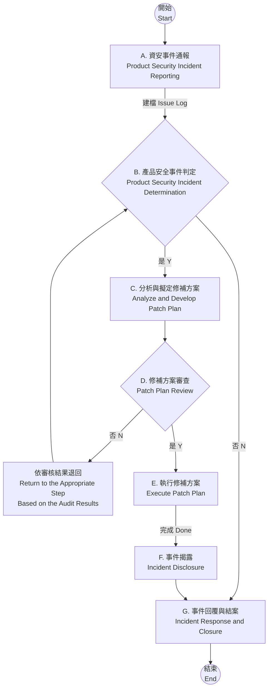

# 產品安全_事件管理程序 Product Security Incident Management Procedures

**文件類別 Doc. Category：** 程序 Procedures  
**文件編號 Doc. NO：** 208  
**版本 Rev：** A.01

---

## 歷屆版本 Revision History

| 版本 Revision | 更版日期 Revised Date | 更版者 Revised By | 更版內容 Description | 審核者 Reviewer |
|---|---|---|---|---|
| A.01 | 202X-XX-XX | XX XX | 初建立。First release. | XXX |

---

## 目錄 CONTENTS

1. [目的 Purpose](#1-目的-purpose)
2. [範圍 Scope](#2-範圍-scope)
3. [定義 Definition](#3-定義-definition)
   1. [產品安全事件 Product Security Incidents](#31-產品安全事件-product-security-incidents)
   2. [內外部利害關係人 Internal and External Stakeholders](#32-內外部利害關係人-internal-and-external-stakeholders)
   3. [產品安全事件通報人 Product Security Incident Reporter](#33-產品安全事件通報人-product-security-incident-reporter)
   4. [內部聯繫窗口 Internal Contact](#34-內部聯繫窗口-internal-contact)
   5. [XXXX系統 XXXX System](#35-xxxx系統-xxxx-system)
   6. [漏洞評分系統 Vulnerability Scoring System](#36-漏洞評分系統-vulnerability-scoring-system)
   7. [可接受剩餘風險等級 Acceptable Residual Risk Level](#37-可接受剩餘風險等級-acceptable-residual-risk-level)
   8. [產品安全事件調查人員 Product Security Incident Investigator](#38-產品安全事件調查人員-product-security-incident-investigator)
   9. [公共漏洞和暴露 Public Vulnerabilities and Exposures (CVE)](#39-公共漏洞和暴露-public-vulnerabilities-and-exposures-cve)
   10. [常見脆弱性評分系統 Common Vulnerability Scoring System (CVSS)](#310-常見脆弱性評分系統-common-vulnerability-scoring-system-cvss)
   11. [軟體物料清單 Software Bill of Materials (SBOM)](#311-軟體物料清單-software-bill-of-materials-sbom)
   12. [對外發布管道 External Announcement Channels](#312-對外發布管道-external-announcement-channels)
   13. [資安事件通報對象 Security Incident Reporting Recipients](#313-資安事件通報對象-security-incident-reporting-recipients)
   14. [CVE資料庫 CVE Database](#314-cve資料庫-cve-database)
4. [角色與權責 Roles and Responsibilities](#4-角色與權責-roles-and-responsibilities)
   1. [PSIRT](#41-psirt)
   2. [PSIRT Leader](#42-psirt-leader)
   3. [RD Leader](#43-rd-leader)
   4. [RevG](#44-revg)
   5. [SPMO](#45-spmo)
5. [作業內容 Operating Content](#5-作業內容-operating-content)
   1. [流程圖 Flowchart](#51-流程圖-flowchart)
   2. [流程步驟 Process Steps](#52-流程步驟-process-steps)
6. [作業規範 Operating Regulations](#6-作業規範-operating-regulations)
   1. [產品安全事件通報 Product Security Incident Reporting](#61-產品安全事件通報-product-security-incident-reporting)
   2. [產品安全事件判定 Product Security Incident Determination](#62-產品安全事件判定-product-security-incident-determination)
   3. [分析與擬定修補方案 Analyze and Develop Remediation Plan](#63-分析與擬定修補方案-analyze-and-develop-remediation-plan)
   4. [審查修補方案 Remediation Plan Review](#64-審查修補方案-remediation-plan-review)
   5. [執行修補方案 Execute Remediation Plan](#65-執行修補方案-execute-remediation-plan)
   6. [事件揭露 Incident Disclosure](#66-事件揭露-incident-disclosure)
   7. [回報與結案 Response sand Closure](#67-回報與結案-response-sand-closure)
   8. [定期審查安全缺陷管理實踐 Regularly review security defect management practices](#68-定期審查安全缺陷管理實踐-regularly-review-security-defect-management-practices)
7. [相關文件與表單 Relevant Documents and Forms](#7-相關文件與表單-relevant-documents-and-forms)
8. [附錄 Appendix](#8-附錄-appendix)

---

## 1. 目的 Purpose

為落實產品安全國際標準之網宇安全要求，確保執行產品安全所需活動、程序和方法的有效性與合規性，進而避免資安風險，提升產品品質，特制定本文件。其目的在建立完善的網宇安全事件管理機制，以協助執行同仁落實在產品發生網宇安全事件時的應對作業，本文件參照產品安全國際標準中對產品事件處理相關要求事項編訂。

In order to implement the cybersecurity requirements of international product security standards and ensure the effectiveness and compliance of activities, procedure, and methods required for product security, thereby mitigating cybersecurity risks and improving product quality, this document is specially formulated. The purpose is to establish a complete cybersecurity incident management mechanism to assist execution colleagues in implementing response operations when product cybersecurity incidents occur. This document is compiled with reference to the requirements related to product incident handling in the international product security standards.

## 2. 範圍 Scope

本公司應符合產品安全國際標準要求之網宇安全相關管理制度、產品開發、測試、生產、維運及汰除等活動及其衍生的服務專案。

The company shall comply with the requirements of international product security standards regarding cybersecurity-related management systems, product development, testing, production, maintenance, operation activities, and decommissioning as well as associated service projects.

## 3. 定義 Definition

### 3.1 產品安全事件 Product Security Incidents

在本程序中簡稱「事件」，為被舉報之產品中存在的安全性缺陷或弱點，可能被惡意利用，導致資訊外洩、系統受到攻擊、數據損毀、用戶隱私泄露或其他安全問題。這些漏洞可能是由於設計不良、程式編寫錯誤、安全設定不當、未更新的軟體版本、或者未考慮到新興的安全風險所導致。

“Incidents” in this process are a security flaw or weakness in the reported product that may be exploited to cause information disclosure, system attack, data corruption, user privacy breach, or other security issues. The vulnerabilities can be caused by poor design, programming bugs, improper security settings, outdated software versions, or not taking into account emerging security risks.

### 3.2 內外部利害關係人 Internal and External Stakeholders

在本程序中簡稱「關係人」，為與產品安全有利害關係之人或組織群體等等。例如：產品客戶、研發單位、品質單位、生產單位、終端使用者，內部PM，測試人員等。

In this procedure, referred to as a “Stakeholders”, is a person or group of organizations interested in product security, etc. For example: product customers, R&D units, quality units, production units, end users, internal PM, testers, etc.

### 3.3 產品安全事件通報人 Product Security Incident Reporter

本程序中簡稱「通報人」，可為內外部利害關係人，如:產品客戶，終端使用者，內部PM，測試人員等等…

In this process, referred to as “Reporter”, may be internal and external stakeholders, such as: product customers, end users, internal PM, testers, etc...

### 3.4 內部聯繫窗口 Internal Contact

在本程序中為本公司之業務。

In this Procedures, we handle the business of our company.

### 3.5 XXXX系統 XXXX System

全名為XXXX系統，在本程序中負責用來接收並追蹤來自產品安全事件通報人所通報的產品安全事件，並用之記錄聯繫各通報人與關係人的結果(e.g.信件內容包含客戶mail帳戶，email內容截圖等)。

The full name is XXXX and is responsible for receiving and tracking product security incidents reported by the reporter of the product security incident in this procedure, and to record the results of contacting the reporters and stakeholders (e.g. mail content including customer mail accounts, email screenshots, etc.).

### 3.6 漏洞評分系統 Vulnerability Scoring System

是一個開放系統，用於評估產品漏洞的特徵和嚴重性，作為評估產品安全漏洞剩餘風險等級。在本程序中，使用Common Vulnerability Scoring System (CVSS)作為漏洞評分系統，其操作請參考以下連結：

<https://www.first.org/CVSS/v3.1/user-guide>

It is an open system that evaluates the characteristics and severity of vulnerabilities in a product as an assessment of product security vulnerability residual risk level. In this procedure, the Common Vulnerability Scoring System (CVSS) is used as a vulnerability scoring system. Please refer to the following link for the operation:

<https://www.first.org/CVSS/v3.1/user-guide>

### 3.7 可接受剩餘風險等級 Acceptable Residual Risk Level

評估後之產品安全事件剩餘風險降低至低等級(CVSS<4.0)。

Evaluated residual risk of product security incidents is reduced to a low level (CVSS<4.0).

### 3.8 產品安全事件調查人員 Product Security Incident Investigator

簡稱「調查人員」，為具有使用漏洞分析工具(如開源Nmap、開源Nexus Open Source Vulnerability Scanner、商用SecDevice、商用Nessus等)之能力者，可對通報訊息進行驗證。例如：PSIRT、RD等等…

“Investigator” is the ability to use vulnerability analysis tools such as Open Source Nmap, Open Source Nexus Open Source Vulnerability Scanner, Commercial SecDevice, Commercial Nessus, etc., to verify reporting messages. For example: PSIRT, RD, etc...

### 3.9 公共漏洞和暴露 Public Vulnerabilities and Exposures (CVE)

列出了已公開披露的各種電腦安全安全缺陷。

Lists various computer security defects that have been publicly disclosed.

### 3.10 常見脆弱性評分系統 Common Vulnerability Scoring System (CVSS)

是一個開放框架，用於傳達軟件漏洞的特徵和嚴重性，作為評估軟體安全漏洞風險等級。

It is an open framework used to communicate the characteristics and severity of software vulnerabilities as an assessment of software security vulnerability risk levels.

### 3.11 軟體物料清單 Software Bill of Materials (SBOM)

軟體物料清單是軟體的嵌套清單，是構成軟體元件的成分列表。包含專有和開源軟體組件、版本和許可證等列表。

A software bill of materials is a nested list of software components that make up a software component. Contains a list of proprietary and open source software components, versions and licenses.

### 3.12 對外發布管道 External Announcement Channels

為本公司官網之XXXX。

For the XXXX system that manages the network of our company...

### 3.13 資安事件通報對象 Security Incident Reporting Recipients

對於資安事件具敏感度，須盡早研擬對應措施之單位，本程序中指的是SPMO、RD Leader與PM。

For sensitive security incidents, the units of countermeasures must be developed as early as possible. This procedure refers to SPMO, RD Leader, and PM.

### 3.14 CVE資料庫 CVE Database

網址 <https://www.CVEdetails.com/index.php>

## 4. 角色與權責 Roles and Responsibilities

以下為本程序參與角色與權責定義，其實際對應部門請參閱《101_產品安全_政策及組織》。

The following is the definition of Role and responsibilities involved in this procedure. See 101_Product Security_Policy and Organization for the actual corresponding department.

### 4.1 PSIRT

**產品資安事件處理小組 Product Security Incident Response Team (PSIRT)**

A. 負責通報發行後的產品安全事件，並於內部系統建案與定期追蹤。  
Responsible for reporting post-release product security incidents, construction and periodic tracking of internal systems.

B. 接收來自組織內部或外部所發現產品現存的弱點或瑕疵，並判別是否為產品安全事件。  
Receive existing vulnerabilities or defects from products discovered inside or outside your organization and determine if they are product security incidents.

C. 產品安全事件分析與判定。  
Product security incident analysis and determination.

D. 公告緩解方案。  
Announcement of mitigation programs.

E. 定期向通報者更新事件處理進度。  
Regularly update the incident processing progress to the reporter.

F. 將安全事件管理流程過程中產出與審核之資料備存於內部系統。  
Keep the data generated and audited medium the security incident management process in the internal system.

G. 定期向客戶更新事件處理進度。  
Regularly update the incident processing progress to customers.

H. 檢查自上次定期審查以來通過流程管理的安全相關問題，以確定管理流程是否完整、高效，並導致每個安全相關問題的解決。  
Examine security-related issues managed through processes since the last regular review to determine whether the management process is complete and efficient and lead to resolution of each security-related issue.

I. 負責通報產品安全事件公告給受影響之客戶。  
Responsible for reporting product security incident announcements to affected customers.

### 4.2 PSIRT Leader

**產品資安事件處理小組 Product Security Incident Response Team Leader (PSIRT Leader)**

A. 審核產品安全事件判定結果。  
Review the product security incident determination results.

### 4.3 RD Leader

**產品研發處主管 Product Research & Design Leader (RD Leader)**

A. 分析與研擬產品安全事件修補方案  
Analyze and develop patching solutions for product security incidents

B. 評估事件影響範圍及管制產品安全相關議題之處理進度。  
Evaluate the impact of the incident and control the progress of processing issues related to product security.

C. 評估事件涉及安全漏洞的剩餘風險等級。  
Assess the remaining risk level of the vulnerability involved in the incident.

D. 指派人員進行修補，解決安全問題。  
Assign people to patch and resolve security issues.

E. 研擬揭露內容。  
Develop disclosure content.

F. 當問題涉及外部供應商，通報外部供應商並請其處理。  
When an issue involves an external supplier, report to the external supplier and ask for it to be addressed.

### 4.4 RevG

**審查團隊 Review Group**

A. 由SPMO代表、SDT代表、SCT代表、SVT代表、PM代表與PSIRT代表組成，參與本程序相關審查作業。  
Consists of SPMO representatives, SDT representatives, SCT representatives, SVT representatives, PM representatives and PSIRT representatives to participate in the review related to this process.

B. 審查內容包含修補方案與相關揭露或通知文案的內容等等。  
The review includes the content of patches and related disclosures or notices.

### 4.5 SPMO

**產品安全管理辦公室 Security Product Management Office (SPMO)**

A. 協助相關人員提供產品安全開發過程所需諮詢服務。  
Assist relevant personnel to provide consultation services required for product security development process.

B. 持續改善本流程之執行品質並提升效率。  
Continuously improve the quality and efficiency of this procedure.

## 5. 作業內容 Operating Content

### 5.1 流程圖 Flowchart

| 流程 Process | 權責人員 Responsible Person |
|---|---|
| 產品安全事件通報 | PSIRT |
| 產品安全事件判定 | PSIRT、PSIRT Leader |
| 分析與擬定修補方案 | RD Leader |
| 修補方案審查 | RD Leader、RevG、PSIRT、PSIRT Leader |
| 執行修補方案 | RD、RD Leader、PCC Leader |
| 事件揭露 | PSIRT |
| 事件回覆與結案 | PSIRT |

### 5.2 流程步驟 Process Steps

#### A. 產品安全事件通報 Product Security Incident Reporting

產品安全開發流程【產品安全發行】階段完成後，當產品安全事件通報人將產品安全事件透過XXXX系統通報時，系統會及時發布訊息通知PSIRT，之後啟動本流程。

After the product security development process 【Product Security Release】 phase is completed, a message will be issued to notify PSIRT when a product security incident is notified through the XXXX system by a product security incident reporter, and then the process is initiated.

- **角色 Role：** PSIRT
- **輸入 Input：** 產品安全事件資訊 Product Security Incident Information
- **輸出 Output：** 《413_產品安全_事件內外部通報表_Product Security_Internal and External Incident Reporting Form》
- **參考 Reference：** 章節 Chapter 6.1

由PSIRT將通報的產品安全事件資訊，彙整於《413_產品安全_事件內外部通報表》後，向資安事件通報對象進行通報。相關規範，請參見章節6.1。之後進到下一步驟【產品安全事件判定】

The PSIRT will report the product security incident information reported in the 413_Product Security_Internal and External Incident Reporting Form to the Stakeholders to whom the incident was reported. Please refer to chapter 6.1 for the regulations of this step. Then go to the next step [Product Security Incident Determination]

#### B. 產品安全事件判定 Product Security Incident Determination

- **角色 Role：** PSIRT、PSIRT Leader
- **輸入 Input：** 《413_產品安全_事件內外部通報表_Product Security_Internal and External Incident Reporting Form》
- **輸出 Output：** 《418_產品安全_作業與審查申請書_Product Security_Operations and Review Application Form》、《412_產品安全_事件判定與緩解措施紀錄表_Product Security_Incident Determination and Mitigation Measures Record Form》
- **參考 Reference：** 章節 Chapter 6.2
- **簽核 Approver：** PSIRT Leader

PSIRT於3個工作日內依據《413_產品安全_事件內外部通報表》進行產品安全事件判定與風險評估，其結果須記錄於《412_產品安全_事件判定與緩解措施紀錄表》之[事件判定]與[風險分析]分頁中，完成後，填寫《418_產品安全_作業與審查申請書》提交PSIRT Leader簽核。若判別結果非屬產品安全相關問題，則直接進到【事件回覆與結案】步驟。但若經判別實屬產品之安全相關問題，則通知RD Leader評估影響範圍與修補方案，進到下一步驟【分析與擬定修補方案】。相關規範，請參見章節6.2。

PSIRT conducts product incident determination and risk assessment according to “413_ Product Security_Internal and External Incident Reporting Form” within 3 working days. The results must be recorded in the “Incident Determination” and “Risk Analysis” tab of “412_Product Security_Incident Determination and Mitigation Measures Record Form”, fill in the “418_Product Security_Operations and Review Application Form” and submit the PSIRT Leader for approval. If the result is not a product security-related issue, proceed directly to the “Incident response and resolution” step. However, if security related issues are identified, RD Leader will be informed to evaluate the impact scope and remediation plan and proceed to the next step [Analyze and Develop Remediation Plan]. Please refer to chapter 6.2 for the regulations of this step.

#### C. 分析與擬定修補方案 Analyze and Develop Remediation Plan

- **角色 Role：** RD Leader
- **輸入 Input：** 《413_產品安全_事件內外部通報表_Product Security_Internal and External Incident Reporting Form》、《412_產品安全_事件判定與緩解措施紀錄表_Product Security_Incident Determination and Mitigation Measures Record Form》
- **輸出 Output：** 《418_產品安全_作業與審查申請書_Product Security_Operations and Review Application Form》、《415_產品安全_事件關係人告知書_Product Security_Incident Stakeholder Notification》、《422_產品安全_利害相關方清單_Product Security_Stakeholder List》
- **參考 Reference：** 章節 Chapter 6.3.1、章節 Chapter 6.3.2、章節 Chapter 6.3.3

RD Leader評估產品安全事件影響程度與範圍，並擬定修補方案，評估方法與處理天數等相關規範，請參見章節6.3.1。擬定修補方案相關規範，請參見章節6.3.2與6.3.3。完成後填寫下項目：

- 《412_產品安全_事件判定與緩解措施紀錄表》之[緩解措施]分頁
- 《422_產品安全_利害相關方清單》，以蒐集內外部利害關係人
- 《415_產品安全_事件關係人告知書》，以通知內外部利害關係人
- 《418_產品安全_作業與審查申請書》，提交審查

進到下一步驟【修補方案審查】

RD Leader assesses the impact and scope of product security incidents, develops remediation plan, and specifies relevant standards for assessment methods and processing duration. Please refer to chapter 6.3.1 for the evaluation criteria. For the development of remediation plan, please refer to chapter 6.3.2 and 6.3.3. After completion, fill out the following items:

- [Mitigation Measures] tab of “412_Product Security_Incident Determination and Mitigation Measures Record Form”
- 422_Product Security_Stakeholder List, for collecting and maintaining records of internal and external stakeholders.
- 415_ Product Security_Incident Stakeholder Notification to Inform Internal and External Stakeholders
- 418_ Product Security_Operations and Review Application Form, submit for review

Proceed to the next step [Remediation plan Review]

#### D. 修補方案審查 Remediation Plan Review

- **角色 Role：** RD Leader、RevG、PSIRT
- **輸入 Input：** 《418_產品安全_作業與審查申請書_Product Security_Operations and Review Application Form》、《413_產品安全_事件內外部通報表_Product Security_Internal and External Incident Reporting Form》、《412_產品安全_事件判定與緩解措施紀錄表_Product Security_Incident Determination and Mitigation Measures Record Form》、《415_產品安全_事件關係人告知書_Product Security_Incident Stakeholder Notification》、《422_產品安全_利害相關方清單_Product Security_Stakeholder List》
- **輸出 Output：** 《418_產品安全_作業與審查申請書_Product Security_Operations and Review Application Form》、《419_產品安全_會議紀錄_Product Security_Meeting Minutes》
- **參考 Reference：** 章節 Chapter 6.4
- **簽核 Approver：** PSIRT Leader

RD Leader召開會議，邀請RevG相關人員，依據《413_產品安全_事件內外部通報表》審查《412_產品安全_事件判定與緩解措施紀錄表》、《415_產品安全_事件關係人告知書》、《422_產品安全_利害相關方清單》。本步驟之規範，請參見章節6.4。若審查不通過，則退回特定步驟，待完成該步驟後，重新提交審查。若審查通過，提交PSIRT Leader簽核。完成後，將《415_產品安全_事件關係人告知書》，交給PSIRT。由PSIRT通知事件通報者與受影響之內外部利害關係人並將相關聯絡資料（例如信件內容包含客戶mail帳戶之截圖）記錄於系統存查。完成後通知RD進到下一步驟【執行修補方案】。

RD Leader held a meeting to invite RevG relevant personnel to review the 412_Product Security_Incident Determination and Mitigation Measures Record Form, 415_Product Security_Incident Stakeholder Notification, and 422_Product Security_Stakeholder List based on the “413_Product Security_Internal and External Incident Reporting Form. Please refer to chapter 6.4 for the regulations of this step. If the review fails, go back to a specific step and resubmit the review after completing that step. If the review passes, submit the PSIRT Leader for approval. After completion, give the 415_Product Security_Incident Stakeholder Notification to the Incident Stakeholder to PSIRT. The PSIRT notifies the reporter of the incident and the affected internal and external stakeholders and records the relevant contact information (such as the contents of the mail containing screenshots of the customer's mail account) in the system. Notify RD after completion to the next step [Execute Remediation plan].

#### E. 執行修補方案 Execute Remediation Plan

- **角色 Role：** RD Leader、RD
- **輸入 Input：** 《413_產品安全_事件內外部通報表_Product Security_Internal and External Incident Reporting Form》、《412_產品安全_事件判定與緩解措施紀錄表_Product Security_Incident Determination and Mitigation Measures Record Form》
- **輸出 Output：** 《416_產品安全_事件解決方案公告_Product Security_Incident Resolution Announcement》、《418_產品安全_作業與審查申請書_Product Security_Operations and Review Application Form》、聯繫記錄 Contact Record
- **參考 Reference：** 章節 Chapter 6.5、《212_產品安全_更新管理程序_Product Security_Update Management Procedures》
- **簽核 Approver：** PSIRT Leader

RD Leader依照《412_產品安全_事件判定與緩解措施紀錄表》之[緩解措施]分頁所記錄的修補作業與《413_產品安全_事件內外部通報表》，研擬產品安全事件揭露內容，填寫《416_產品安全_事件解決方案公告》，同時執行修補方案，執行時若需產出安全更新，需依照《212_產品安全_更新管理程序》之規範進行，待於時限內修補完成回報。完成後，填寫《418_產品安全_作業與審查申請書》，提交PSIRT Leader審查與簽核。完成後，通知PSIRT並提供《416_產品安全_事件解決方案公告》，進到下一步驟【事件揭露】，本階段需追蹤之漏洞、弱點、風險、威脅、事件等，應需記錄於《426_產品安全_漏洞追蹤清單》中，以利後續進行定期追蹤。本步驟之規範，請參見章節6.5。

RD Leader develops the disclosure of product security incidents according to the patch operations recorded in the Mitigation tab of the 412_Product Security_Incident Determination and Mitigation Measures Record Form and 413_ Product Security_Internal and External Incident Reporting Form, and fill in the 416_ Product Security_Incident Resolution Announcement, run the remediation plan at the same time. If you need to produce security updates, must follow the “212_Product Security_Update Management Procedures”, patch within the time limit to complete the report. After completion, fill in the “418_Product Security_Operations and Review Application Form” and submit the PSIRT Leader for review and approval. Upon completion, notify the PSIRT and provide the “416_Product Security_Incident Resolution Announcement”. Proceed to the next step [Incident Disclosure]. Vulnerabilities, weaknesses, risks, threats, or incidents to be tracked in this stage shall be recorded in the "426_Product Security_Vulnerability Tracking List" to facilitate subsequent periodic tracking. Please refer to chapter 6.5 for the regulations of this step.

#### F. 事件揭露 Incident Disclosure

- **角色 Role：** PSIRT
- **輸入 Input：** 《416_產品安全_事件解決方案公告_Product Security_Incident Resolution Announcement》、《422_產品安全_利害相關方清單_Product Security_Stakeholder List》
- **輸出 Output：** 聯繫紀錄 Contact record、《409_產品安全_事件檢核表_Product Security_Incident Checklist》
- **參考 Reference：** 章節 Chapter 6.6

PSIRT填寫《409_產品安全_事件檢核表》做自我檢核，若發現錯誤或遺漏，則退回對應步驟處理，完成後，將通過審核的《416_產品安全_事件解決方案公告》，根據《422_產品安全_利害相關方清單_Product Security_Stakeholder List》中提供給受影響之客戶並將聯繫記錄記錄於系統。同時公告於對外發布管道。本步驟之規範，請參見章節6.6。完成後，進到下一步驟【事件回覆與結案】

PSIRT completes the “409_Product Security_Incident Checklist” for self-checking. If errors or omissions are found, the corresponding steps will be returned to processing. Upon completion, the approved 416_ Product Security_Incident Resolution Announcement shall be provided to the affected customers based on the “422_Product Security_Stakeholder List,” and record the contact record in the system. At the same time the announcement is published on the external channel. Please refer to chapter 6.6 for the regulations of this step. After completion, go to the next step [Incident Response and Closure]

#### G. 事件回覆與結案 Incident Response and Closure

- **角色 Role：** PSIRT
- **輸入 Input：** 《416_產品安全_事件解決方案公告_Product Security_Incident Resolution Announcement》
- **輸出 Output：** 聯繫記錄 Contact Record
- **參考 Reference：** 章節 Chapter 6.7

PSIRT以通過審核的《416_產品安全_事件解決方案公告》通知產品安全事件通報人，並將聯繫記錄上傳至系統留存備後，於系統關閉結案，本步驟之規範請參考章節6.7。本流程結束。

PSIRT notifies the Product Security Incident Noticer through the audited 416_ Product Security_Incident Resolution Announcement and uploads the contact record to the system and closes the case after the system is closed. Please refer to chapter 6.7 for the regulations of this step. This process ends.

#### H. 安全事件能量維護 Capability Maintenance for Security Incidents (DM-6)

安全事件處理完成後，應由SPMO定期召集PSIRT，收集各次安全事件處理時的缺失與建議，於執行《213_產品安全_管理審查程序》時提出檢討，持續改善安全事件處理品質並提升效率。相關規範請參照章節6.8。

After security incident processing is completed, the SPMO should regularly convene PSIRT to collect defects and recommendations medium the implementation of the 213_ Product Security_Management Review Procedures to continuously improve the quality of security incident handling and improve efficiency. Please refer to chapter 6.8 for the regulations of this step.

## 6. 作業規範 Operating Regulations

### 6.1 產品安全事件通報 Product Security Incident Reporting

#### 通報來源 Reporting Source

接收和追蹤由內部和外部來源通報之產品中封閉與安全性相關議題之來源，至少包括：

Receive and track sources of closed and security-related issues in products reported by internal and external sources, including at a minimum:

A. 安全驗證和確認測試人員。如外部安全驗證及確認測試人員(包括研究人員)。  
Secure verification and confirmation testers. Such as external security verification and confirmation testers (including researchers).

B. 產品中使用第三方元件的供應商。  
Suppliers that use third-party components in the product.

C. 產品開發者及測試者。  
Product developers and testers.

D. 產品使用者，包括整合者、資產擁有者及維護人員。  
Product users, including integrators, asset owners, and maintainers.

E. 其他，即組織內部可能會收到外部客戶或供應商訊息之任何人員。  
Other, any person within your organization who may receive external customer or supplier messages.

#### 通報管道 Reporting Channels

用來接收來自內外部的產品安全事件通報。為確保產品安全事件處理溝通之有效性，通報頁面的欄位包含但不限於以下欄位：

Used to receive product security incident notifications from internal and external sources. To ensure the effectiveness of product security incident handling communications, the fields on the reporting page include, but are not limited to, the following fields:

A. 通報人的基本資訊，例如姓名。  
Basic information of the reporter, such as name.

B. 通報人聯繫方式，例如Email、電話。  
Contact information of the reporter, such as Email, phone number.

C. 產品安全事件之主旨與描述，請參照章節6.1.3.1 項次B~E。  
Please refer to chapter 6.1.3.1, Item B~E for the subject and description of product security incidents.

D. 其他。  
Others.

#### 通報資訊處理之規範 Regulations on the Processing of Reporting Information

##### 蒐集有助於驗證與核實所需之資訊 Gather information needed to facilitate verification and verification

通報內容須包含以下資訊：

The report must contain the following information:

A. 通報來源(詳見章節6.1.1之規範)  
Sources of reporting (see Chapter 6.1.1 for details)

B. 產品型號  
Product Model

C. 產品軟體版本號或開源軟體版本  
Product software version number or open source version

D. 通報考量或說明  
Reporting Considerations or Descriptions

E. 其他 (若為公開漏洞請標明，如CVE-2021-XXX)。  
Others (Please indicate if it is a public vulnerability, such as CVE-2021-XXX).

##### 保護所通報資訊之機密性及存取權限之規範 Regulations to protect the confidentiality and access rights of reported information

A. 若通報資訊以e-mail方式聯繫，則應使用PGP公鑰或其他方式進行加密，以確保機密性。  
If the notification information is contacted by e-mail, it should be encrypted using PGP public key or other means to ensure confidentiality.

B. 通報系統之存取權限（唯讀）僅開放予事件處理的相關人員。  
Access to the reporting system (read-only) is only open to personnel involved in the incident handling.

##### 與通報與安全性相關議題之個體溝通的程度 Level of communication with individuals reporting security-related issues

收到內外部安全性相關議題通報，至少須蒐集到章節6.1.3.1所規範之內容。若資訊不足，須於3個工作日內與通報人聯繫，溝通的要點須包含：

At least chapter 6.1.3.1 is required to receive internal and external security-related communications. If there is insufficient information, contact the notifier within 3 working days. The main points of communication must include:

A. 產品安全事件處理進度  
Progress of Product Security Incident Processing

B. 欠缺的產品安全事件之資訊（如有需要）。  
Information about missing product security incidents, (if necessary).

C. 產品安全事件通報人關於此事件處理的反饋  
Feedback from the Product Security Incident adviser about the handling of this incident.

D. 預計下次聯繫的時間  
Expected time of next contact.

##### 處理發現之第三方元件弱點（脆弱性）的策略

若安全問題來自於第三方供應商之元件，則依據章節6.3.3規範進行。

If the security issue comes from components of a third-party supplier, it is governed by chapter 6.3.3.

### 6.2 產品安全事件判定 Product Security Incident Determination

#### 判定條件 Determination Conditions

調查人員應於3個工作日內對通報訊息進行判定是否為安全性相關議題，提交審查與簽核，並將結果記錄。判定時須考量以下(但不限於)之條件：

The investigator shall determine whether the notification is a security-related issue within 3 business days, submit for review and approval, and record the results. The following (but not limited to) conditions shall be considered in the determination:

A. **產品之適用性 Product Applicability**  
調查人員需要評估通報的問題是否與特定的產品相關，即問題是否會影響或存在於該產品中。參考做法如下：

Investigators need to assess whether reported issues are related to a particular product, i.e., whether the issue affects or exists in that product. Reference practices are as follows:

- 外部元件供應商所提供的二進位檔與其之後所提供對其元件的後續修補程式具已知安全漏洞。
- 確認已獲批准的《414_產品安全_軟體物料清單》，是否在產品開發生命週期中使用具已知安全漏洞的軟體或韌體。

B. **可驗證性 Verifiability**  
調查人員需要確定報告的問題是否可以被驗證。這意味著該問題是否可以被測試、重現或以其他方式驗證，以確定其真實性和有效性，避免對未經證實的問題作出不必要的回應。參考做法如下：

Investigators need to determine if reported issues can be verified. This means whether the issue can be tested, reproduced or otherwise verified to determine its authenticity and effectiveness and avoid unwarranted responses to unproven issues. Reference practices are as follows:

- 嘗試重現所通報的脆弱性或檢查產品中第三方嵌入之程式原始碼之用法。

C. **引發事件的威脅來源 Threat Sources Triggering the Incident**  
調查人員需要識別並評估問題所涉及的威脅。這包括分析該問題是否與已知的威脅情境相關聯，以及該問題是否可能被利用來實施攻擊或危害系統的安全。

Investigators need to identify and assess the threat involved in the issue. This includes analyzing whether the issue is associated with a known threat scenario and whether the issue could be exploited to implement attacks or compromise the security of the system.

#### 判定後處置措施 Post-determination Disposal Measures

A. 當問題涉及外部供應商，通報外部供應商並請其處理。  
When an issue involves an external supplier, report to the external supplier and ask for it to be addressed.

B. 處理者經查證因該安全議題因無法驗證或不適用而判定非屬產品之安全相關議問題，將原因與說明記錄於《412_產品安全_事件判定與緩解措施紀錄表》之[Note]欄位，並通知資安事件通報對象與通報人。其聯繫記錄上傳至系統留存備後於系統後得以結案。  
The Processor has verified that the security issue is not a product because it cannot be verified or not applicable. The reason and description are recorded in the Note field of the 412_Product Security_Incident Determination and Mitigation Measures Record Form and notify the person to whom the security incident was reported and the reporter. The contact record is uploaded to the system and retained after the system can be closed.

C. 經查證屬產品之安全相關問題後，於5個工作日內研擬《415_產品安全_事件關係人告知書》的內容。  
After verifying the security related issues of the product, the content of the 415_Product Security_Incident Stakeholder Notification to the Incident will be prepared within 5 working days.

D. 若確認為產品安全漏洞，需使用漏洞評分系統進行衝擊性分析，確認問題的嚴重性(風險等級)，填寫《412_產品安全_事件判定與緩解措施紀錄表》。其判定風險等級定義如下表：

| CVSS分數 CVSS Score | 風險等級 Risk Level |
|---|---|
| <= 3.9 | 低 Low |
| 4.0 – 6.9 | 中 Medium |
| >= 7.0 | 高 High |

E. 經由漏洞評分系統確認問題的風險等級後，須在一定時限內將研擬完成的《415_產品安全_事件關係人告知書》發給內外部利害關係人，告知該產品安事件的發生，通報時限請參考下表，並將聯繫記錄上傳至系統留存：

| 風險等級 Risk Level | 通報時限 Reporting Time Limit |
|---|---|
| 低 Low | 30天 days |
| 中 Medium | 20天 days |
| 高 High | 10天 days |

**註 Note：**

- 通報天數自接收到安全事件當日起開始計算。

### 6.3 分析與擬定修補方案 Analyze and Develop Remediation Plan

#### 影響範圍評估與對應作業 Impact Scope Assessment and Mapping Operations

經由使用核准《414_產品安全_軟體物料清單》或《430_產品安全_開發與檢測工具清單》所核准的漏洞分析工具(如開源Nmap、開源Nexus Open Source Vulnerability Scanner、商用SecDevice、商用Nessus等)，進行評估安全相關問題，應評估以下(但不限於)項目：

Assess security-related issues by using the approved vulnerability analysis tools (such as Open Source Nmap, Open Source Nexus Open Source Vulnerability Scanner, Commercial SecDevice, Commercial Nessus, etc.) approved by the approved 414_Product Security_Software Bill of Materials or the 430_Product Security_Development and Testing Tools List. Next (but not limited to) items:

A. 評估其(問題)對以下的影響 Evaluate its (problem) impact on

- 發現問題時的實際安全環境。The actual security environment when the problem is found.
- 產品的安全環境。A safe environment for the product.
- 產品的縱深防禦策略。Defense-in-depth strategies for products.

B. 識別包含安全相關問題的所有其他產品/產品版本  
Identify all other product/product versions that contain security-related issues

識別所有安全相關問題的其他產品/產品版本(若有)。應評估與安全相關問題的潛在影響和嚴重性，確定該問題是否存在於其他產品或版本中。

Identify other product/product versions, if any, for all security-related issues. The potential impact and severity of security-related issues should be assessed to determine if the issue exists in another product or version.

C. 識別問題的根本原因  
Identify the root cause of the problem

例如，若存在於其他產品或版本時，通過使用相同或相似的元件找出導致該問題的根本原因。

For example, if present in another product or version, identify the root cause of the problem by using the same or similar components.

D. 識別相關的安全議題  
Identify relevant security issues

針對所問題之根本原因，確定解決方案可能涉及哪些開發生命週期過程（例如重新設計活動和威脅模型更新）。

Determine which development lifecycle processes (such as redesign activities and threat model updates) may be involved in a solution for the root cause of the problem.

E. 評估剩餘風險  
Assess residual risk

擬定修復計畫處理對應的安全性相關議題後，需評估產品最終之剩餘風險等級。

After drawing up a remediation plan to address the corresponding security-related issues, the final remaining risk level of the product is evaluated.

#### 解決各安全相關問題之方法 Solutions to various security-related issues (DM-4)

RD依據PSIRT進行衝擊分析後之風險等級，可依(但不限於)下表規劃因應措施使之剩餘風險等級降至可接受剩餘風險等級：

| 原風險等級 Original Risk Level | 可接受剩餘風險等級 Acceptable Residual Risk Level | 可規劃的因應措施 Plannable Response Measures |
|---|---|---|
| 低 Low | 低 Low | B |
| 中 Medium | 低 Low | A.c、A.d、A.e、B |
| 高 High | 低 Low | A、B |

A. 擬定下列(但不限於)1個或多個措施來解決問題，並記錄於《412_產品安全_事件判定與緩解措施紀錄表》之[Control Measures]欄位  
Develop one or more measures, including but not limited to, to address the issue and record them in the "[Control Measures]" field of the "412_Product Security_Incident Determination and Mitigation Measures Record Form."

- a. 縱深防禦策略或設計變更 Defense-in-depth strategy or design changes
- b. 新增一個或多個安全要求及/或能力 Add one or more security requirements and/or capabilities
- c. 使用補償機制 Utilization Compensation Mechanism
- d. 停用或移除功能 Disable or remove functions
- e. 若修補措施牽涉其他安全開發之程序，則需執行對應的開發程序，例如：需求分析，設計(威脅建模)，實作、安全測試等等.

B. 制定修復計劃以解決問題  
Develop a remediation plan to solve the problem

如果問題是由軟體漏洞引起的，RD須遵循PSIRT所評估之風險等級來確立處理天數，各風險等級之處理天數請參見下表。

| 風險等級 Risk Level | 處理天數 Processing Days |
|---|---|
| 低 Low | 不處置 Not fixing |
| 中 Medium | 90天 (Days) |
| 高 High | 30天 (Days) |

C. 若無法提出修補方案或需延遲問題，應提供解決時機(預計提出相對應的解決措施之時間)，並說明原因和相關風險，記錄於《412_產品安全_事件判定與緩解措施紀錄表》之[Note]欄位。  
If a fix is not available or a delay is required, provide a resolution (the expected time of the corresponding resolution), and explain the causes and associated risks in the Note field of the 412_Product Security_Incident Determination and Mitigation Measures Record Form.

D. 如果剩餘風險等級已低於可接受剩餘風險等級水準，則毋須修正問題。不須報告與交付做評估並提出應對方案。將之記錄於《412_產品安全_事件判定與緩解措施紀錄表》之[Note]欄位。  
If the remaining risk level is already below the acceptable residual risk level, you do not need to fix the problem. There is no need to report and deliver to evaluate and propose a response plan. Record it in the Note field of the 412_Product Security_Incident Determination and Mitigation Measures Record Form.

E. 以判定為可接受風險不予修正之問題，若客戶堅持並且有正當理由，經SPMO評估後可決定是否報告且交付做評估並提出應對方案，將之記錄於《412_產品安全_事件判定與緩解措施紀錄表》之[Note]欄位。  
If the customer adheres to and has a valid reason, if the customer adheres to an acceptable risk, after evaluation by SPMO, can decide whether to report and deliver it for evaluation and propose a response plan, record it in the [Note] field of the 412_Product Security_Incident Determination and Mitigation Measures Record Form.

#### 通知其他流程與第三方 Notifying other processes and third-party

在處理安全事件過程中，也應注意下列狀況通知其他流程與第三方：

As part of the processing of a security incident, you should also be aware of the following conditions to notify other processes and third-party:

A. 將問題或相關問題通知其他流程，包括其他產品/產品修訂的流程。  
Process to notify other processes of issues or related issues, including other product/product revisions.

即當產品安全事件發生時，應於例行會議(e.g.產品月會，業務會議等等之跨部門或產品會議)中提出，從需求規劃開始檢視整個安全開發週期中是否有相關面向未考慮到。例如測試計畫涵蓋面不夠完善。

B. 如果發現包含在第三方供應商之原始碼中的問題，應通知第三方供應商。  
You should notify the third-party provider if problems are found to be included in the source code of the third-party provider.

若安全漏洞存在於由第三方供應商（包括但不限於委外開發或開放原始碼軟體）取得的原始程式碼時，軟體研發部需通知第三方供應商並從第三方供應商取得安全更新，亦應安排相關之安全測試與驗證，以確保滿足產品的所有安全要求事項。相關程序與規範請參考《204_產品安全_委外作業管理程序》

C. 如有法律或法規之要求，應依規定通知相關監管機關及相關利害關係人。  
In the event of legal or regulatory requirements, the relevant regulatory authorities and stakeholders shall be notified in accordance with the applicable provisions.

### 6.4 審查修補方案 Remediation Plan Review

審查時需確認以下事項：

A. 確認依風險評估(衝擊性分析)確立需報告與因應之安全性相關議題皆依計畫將被處理。  
B. 所建議之解決方案不可違反產品其他層面所依賴的安全設計前提。  
C. 由於報告個體之安全性全景與產品安全性全景間不匹配，因此所建議的解決方案可能係非屬必要。  
D. 所建議之解決方案僅能部分減少與安全性相關議題的影響、可能由於其複雜性而花費不可接受之長時間以實作，或者由於無法使用而可能遭停用。  
E. 所建議之解決方案不可引進不可接受的副作用。  
F. 當問題修補完成後，剩餘風險等級須降低至可接受剩餘風險等級。  
G. 如法律或法規有明確要求，應依相關規定及時通知主管監管機關及受影響之利害關係人。通知內容應完整、正確，以供稽核與追溯。

### 6.5 執行修補方案 Execute Remediation Plan

執行修補方案若須產出安全更新，則需啟動《212_產品安全_更新管理程序》來執行。

#### 產品資安公告內容 Product security announcement content

A. 問題描述、根據漏洞評分系統進行的漏洞評分，以及受影響的產品版本。  
B. 解決方案說明，可能包括安裝修補程式參考。  
C. 上述說明應填寫於《416_產品安全_事件解決方案公告》表單。  
D. 應考慮到若問題是由第三方元件引起，第三方元件供應商可能提前公開漏洞與解決方案的可能性。於公告上附上相關說明應對此狀況。(e.g. 說明使用者可自行於第三方元件官網下載更新程式，自行安裝等等.. )

#### 未解決之安全相關問題的定期審查 Periodic review of unresolved security-related issues

A. 須進行各專案產品安全相關問題之進度追蹤及於每月例行會議中彙報進度，以確保問題得到妥善解決。之後進一步整理年度的安全問題執行情況並於管理審查報告。  
B. 當解決產品安全議題的方案是決議在產品實作進行修補時，發佈解決方案的時間可以是產出修補程式的時間，或者可以推遲到下一次發佈產品新版本時。

### 6.6 事件揭露 Incident Disclosure

#### 揭露內容 Disclosure Content

A. 依照審核通過的《416_產品安全_事件解決方案公告》內容。  
B. 若產品受眾為一般使用者，則需揭露於公開管道。  
C. 若產品受眾只為特定使用者群(ex：廠商客戶群)，則只需針對該群成員發布。(ex：發群組mail)

### 6.7 回報與結案 Response sand Closure

A. PSIRT結案後，需收集產品安全事件處理過程的檢討與建議，提交SPMO後續於定期審查會議中討論，相關規範請參見章節6.8。

### 6.8 定期審查安全缺陷管理實踐 Regularly review security defect management practices

A. 定期執行《213_產品安全_管理審查程序》，本程序須於會議中進行審查與更新。  
B. 管理審查會議中須至少檢查自上次定期審查以來通過流程管理的安全相關問題，以確定管理流程是否完整、高效，並導致每個安全相關問題皆獲得處理。  
C. SDT須定期透過CVE資料庫排查以下項目是否有漏洞：

- 所有《414_產品安全_軟體物料清單》中所使用之元件。
- 使用於產品之外部供應商組件。
- 採用產品安全開發程序之所有產品。

並將此排查結果於管理程序中提出檢討。若發現須處理的漏洞，請發起本程序執行《208_產品安全事件管理程序》處理之。

D. 管理審查會議中，須仔細檢查所有開放(未解決)的安全相關問題，以確保它們得到適當處理。  
E. 管理審查會議中，需檢查自上次定期審查以來已處理的安全問題，評估采取哪些措施，以避免類似的問題再次發生。  
F. 管理審查會議中，需檢討評估修復時機的策略。(e.g.修復可能會以發佈修補程式的方式進行，或者修復可能會推遲至下一個版本。)

## 7. 相關文件與表單 Relevant Documents and Forms

- 101_產品安全_政策及組織_ Product Security_Policy and Organization
- 204_產品安全_委外作業管理程序_Product Security_Outsourced Operation Management Procedures
- 208_產品安全事件管理程序_Product Security_Incident Management Procedures
- 212_產品安全_更新管理程序_Product Security_Update Management Procedures
- 213_產品安全_管理審查程序_Product Security_Management Review Procedures
- 409_產品安全_事件檢核表_Product Security_Incident Checklist
- 412_產品安全_事件判定與緩解措施紀錄表_Product Security_Incident Determination and Mitigation Measures Record Form
- 413_產品安全_事件內外部通報表_Product Security_Internal and External Incident Reporting Form
- 414_產品安全_軟體物料清單_Product Security_Software Bill of Materials
- 415_產品安全_事件關係人告知書_Product Security_Incident Stakeholder Notification
- 416_產品安全_事件解決方案公告_Product Security_Incident Resolution Announcement
- 418_產品安全_作業與審查申請書_Product Security_Operations and Review Application Form
- 419_產品安全_會議紀錄_Product Security_Meeting Minutes
- 422_產品安全_利害相關方清單_Product Security_Stakeholder List
- 426_產品安全_漏洞追蹤清單_Product Security_Vulnerability Tracking List
- 430_產品安全_開發與檢測工具清單_Product Security_Development and Testing Tools List

## 8. 附錄 Appendix

無。None.

---

本資料為公司專有之財產，非經書面許可，不准透露或使用本資料，亦不准複印、複製或轉變成其他形式使用。

This information is the exclusive property. Without written permission, this information is not allowed to be disclosed or used, nor is it copied, reproduced or transformed into other forms.
