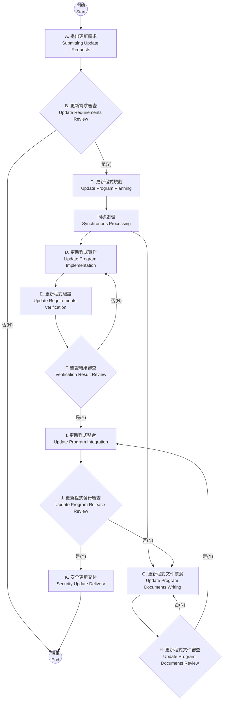

# 產品安全_更新管理程序 Product Security_Update Management Procedures

**文件類別 Doc. Category：** 程序 Procedure  
**文件編號 Doc. NO：** 212  
**版本 Rev：** A.01  

---

## 歷屆版本 Revision History

| 版本 Revision | 更版日期 Revised Date | 更版者 Revised By | 更版內容 Description | 審核者 Reviewer |
|---|---|---|---|---|
| A.01 | 202X-XX-XX | XX XX | 初建立。First release. | XXX |

---

## 目錄 CONTENTS

1. [目的 Purpose](#1-目的-purpose)  
2. [範圍 Scope](#2-範圍-scope)  
3. [定義 Definition](#3-定義-definition)  
4. [角色與權責 Roles and Responsibilities](#4-角色與權責-roles-and-responsibilities)  
5. [作業內容 Operating Content](#5-作業內容-operating-content)  
6. [作業規範 Operating Regulations](#6-作業規範-operating-regulations)  
7. [相關文件與表單 Relevant Documents and Forms](#7-相關文件與表單-relevant-documents-and-forms)  
8. [附錄 Appendix](#8-附錄-appendix)  

---

## 1. 目的 Purpose

為落實產品安全國際標準之網宇安全要求，確保執行產品安全所需活動、程序和方法的有效性與合規性，進而避免資安風險，提升產品品質，特制定本文件。其目的在建立完善的產品安全更新管控機制，以協助執行同仁落實在產品更新時的網宇安全作業，本文件參照產品安全國際標準中對產品更新之相關要求事項編訂。

In order to implement the cybersecurity requirements of international product security standards and ensure the effectiveness and compliance of activities, procedure, and methods required for product security, thereby mitigating cybersecurity risks and improving product quality, this document is specially formulated. The purpose is to establish a complete product security update control mechanism to assist colleagues in implementing network security operations during product updates. This document is compiled with reference to the relevant requirements for product updates in the international product security standards.

## 2. 範圍 Scope

本公司應符合產品安全國際標準要求之網宇安全相關管理制度、產品開發、測試、生產、維運及汰除等活動及其衍生的服務專案。

The company shall comply with the requirements of international product security standards regarding cybersecurity-related management systems, product development, testing, production, maintenance, operation activities, and decommissioning as well as associated service projects.

## 3. 定義 Definition

### 3.1 更新程式需求方 Update Program Demand-side

本程序中簡稱「需求方」，為發現產品安全問題或有安全功能需求者，可為內外部來源，如：業務，客戶，專案經理，終端使用者等等。  
This procedure is referred to as the “Demand-side”. It can be an internal and external source, such as business, customer, project manager, end user, etc. for those who identify or have security function requirements.

### 3.2 產品安全更新時效 Product Security Update Timeliness

本程序中為依據漏洞風險等級所規範之時限，請參考章節 8.1 附錄之漏洞等級與更新時效對應表。  
For the time limits based on the vulnerability risk level in this procedure, please refer to the vulnerability level and update timelines in Appendix of chapter 8.1.

### 3.3 數位簽章 Digital Signatures

指將電子文件以數學演算法或其他方式運算為一定長度之數位資料，以簽署人之私密金鑰對其加密，形成電子簽章，並得以公開金鑰加以驗證者。  
Refers to a person who computes an electronic document into digital data of a certain length, encrypts it with the signer's private key, forms an electronic signature, and authenticates it with a public key.

### 3.4 加密 Encryption

指利用數學演算法或其他方法，將電子文件以亂碼方式處理。  
Refers to the use of mathematical algorithms or other methods to garbled electronic documents.

### 3.5 回歸測試 Regression Testing

係為確認軟體設計變更後仍可正常運作執行，需要執行回歸測試的情境包含但不限於軟體錯誤修復、軟體強化、組態設定變更、或替代性 R 組件更換等情境。  
Scenarios where regression testing is required to ensure that software design changes run properly include, but are not limited to, software bug fixes, software enhancements, configuration changes, or replacement of alternative R components, etc.

### 3.6 外部公布管道 External Announcement Channels

為本公司官網之 XXXX。  
For the XXXX system that manages the network of our company...

## 4. 角色與權責 Roles and Responsibilities

### 4.1 RD Leader
- 評估產品更新範圍與確認產品軟體更新原因。
- 研擬產品更新規格。
- 指派 RD 執行開發作業。
- 審核產品更新需求，更新程式相關文件。

### 4.2 RD
- 進行產品安全更新實作。
- 研擬更新程式相關文件。

### 4.3 RevG
- 由 PCC 代表、SPMO 代表、SDT 代表、SCT 代表、SVT 代表、SET 代表、PM 代表與 PSIRT Leader 組成，參與本程序相關審查作業。
- 審查內容包含產品更新發行前狀態、產品更新說明文件、發行方式與管道，問題改善狀態等等。

### 4.4 QT
- 確認產品安全更新之有效性。
- 確認回歸測試，不因產品安全更新造成副作用。

### 4.5 QT Leader
- 審查產品安全更新之驗證結果。

### 4.6 PSIRT
- 依據需求方提出產品安全更新需求。
- 整合產品安全更新與其說明文件。
- 交付最終產品安全更新結果。

### 4.7 PCC Leader
- 審核產品安全更新文件。
- 更新程式發行審查與簽核。

### 4.8 SPMO
- 協助相關人員提供產品安全開發過程所需諮詢服務。
- 持續改善本流程之執行品質並提升效率。

## 5. 作業內容 Operating Content

### 5.1 流程圖 Flowchart

| 流程 Process | 權責人員 Responsible Person |
|---|---|
| A. 提出更新需求 Submitting Update Requests | PSIRT |
| B. 更新需求審查 Update Requirements Review | PSIRT、RD Leader |
| C. 更新程式規劃 Update Program Planning | RD Leader |
| D. 更新程式實作 Update Program Implementation | RD Leader、RD |
| E. 更新程式驗證 Update Requirements Verification | QT |
| F. 驗證結果審查 Verification Result Review | QT Leader |
| G. 更新程式文件撰寫 Update Program Documents Writing | RD |
| H. 更新程式文件審查 Update Program Documents Review | RD、RD Leader |
| I. 更新程式整合 Update Program Integration | PSIRT |
| J. 更新程式發行審查 Update Program Release Review | PSIRT、RevG、PCC Leader |
| K. 安全更新交付 Security Update Delivery | PSIRT |

### 5.2 流程步驟 Process Steps

當產品安全開發流程【產品安全發行】階段完成後，若有需發佈更新程式（e.g. 修補漏洞，新增功能等等）之需求出現時，更新程式需求方填寫《438_產品安全_更新申請書》，提交 PSIRT 啟動本程序。  
When the product security development process, 【Product Security Release】 stage is completed, if there is a need to release updates (e.g. patches, new functions, etc.), the update program requester fills in the “438_Product Security_Update Request Form” and submits it to PSIRT to activate this process.

#### A. 提出更新需求 Submitting Update Requests

- **角色 Role：** PSIRT  
- **輸入 Input：** 更新程式需求方提出的需求 Requirements submitted by the demand-side of the update program  
- **輸出 Output：**  
  《438_產品安全_更新申請書_Product Security_Update Request Form》  
  《418_產品安全_作業與審查申請書_Product Security_Operations and Review Application Form》  
- **參考 Reference：** 章節 Chapter 6.1  

如有發佈更新程式之需求時，由 PSIRT 依據更新程式需求方提出的需求填寫《438_產品安全_更新申請書》與《418_產品安全_作業與審查申請書》，完成後，通知 RD Leader，進到下一步驟【更新需求審查】。本步驟之相關規範，請參考章節 6.1。  
If there is a need to release the update, PSIRT will fill out the “438_Product Security_Update Request Form” and “418_Product Security_Operations and Review Application Form” according to the requirements raised by the requester. After completion, notify RD Leader and proceed to the next step, [Update Requirements Review]. Please refer to chapter 6.1 for the regulations of this step.

#### B. 更新需求審查 Update Requirements Review

- **角色 Role：** PSIRT、RD Leader  
- **輸入 Input：**  
  《438_產品安全_更新申請書_Product Security_Update Request Form》  
  《418_產品安全_作業與審查申請書_Product Security_Operations and Review Application Form》  
- **輸出 Output：**  
  《418_產品安全_作業與審查申請書_Product Security_Operations and Review Application Form》  
- **參考 Reference：** 章節 Chapter 6.2  
- **簽核 Approver：** RD Leader  

RD Leader 依照 PSIRT 提供的《438_產品安全_更新申請書》內容，進行安全更新需求審查，確認產品更新原因，判定是否需要更新，將原因記錄於《439_產品安全_更新規格書》，直接簽核。簽核完成後，若判定結果不需更新，則直接回覆 PSIRT，本流程結束。若判定需要更新，則進到下一步驟【更新程式規劃】。本步驟之相關規範，請參考章節 6.2。  
RD Leader conducts a security update requirement review according to the content of the “438_Product Security_Update Request Form” provided by PSIRT, confirms the reason for product update, determines whether an update is required, and records the reason in “439_Product Security_Update Specifications” for approval. If the determination result is that no update is required, reply directly to PSIRT and this process ends. If an update is required, proceed to the next step, [Update Program Planning]. Please refer to chapter 6.2 for the regulations of this step.

#### C. 更新程式規劃 Update Program Planning

- **角色 Role：** RD Leader  
- **輸入 Input：**  
  《438_產品安全_更新申請書_Product Security_Update Request Form》  
- **輸出 Output：**  
  《439_產品安全_更新規格書_Product Security_Update Specifications》  
- **參考 Reference：** 章節 Chapter 6.2  

RD Leader 依據《438_產品安全_更新申請書》，訂定預計修改範圍、實作方式、規格與更新時程，並記錄於《439_產品安全_更新規格書》。完成後，通知 RD 進到下一步驟【更新程式實作】與【更新程式文件撰寫】。本步驟之相關規範，請參考章節 6.2。  
RD Leader, based on the “438_Product Security_Update Request Form,” defines the planned modification scope, implementation method, specifications, and update schedule, and records them in “439_Product Security_Update Specifications.” After completion, notify RD to proceed to the next steps, [Update Program Implementation] and [Update Program Documents Writing]. Please refer to chapter 6.2 for the regulations of this step.

#### D. 更新程式實作 Update Program Implementation

- **角色 Role：** RD Leader、RD  
- **輸入 Input：**  
  《439_產品安全_更新規格書_Product Security_Update Specifications》  
- **輸出 Output：**  
  《419_產品安全_會議紀錄_Product Security_Meeting Minutes》  
- **參考 Reference：** 章節 Chapter 6.3  

RD Leader 於開發週會中與 RD 依據《439_產品安全_更新規格書》所記載之更新程式實作方式與規格進行開發討論，決定更新相關開發及單元測試執行之方式與檢視之機制，並指派 RD 進行安全修補程式開發。決議內容須記錄於《419_產品安全_會議紀錄》，作為後續執行之依據。RD 依循會議記錄之內容進行安全修補程式開發，並進到下一步驟【更新程式驗證】。本步驟之相關規範，請參考章節 6.3。  
During the development weekly meeting, RD Leader discusses with RD the implementation approach and specifications of the update based on “439_Product Security_Update Specifications,” determines how update-related development and unit testing will be carried out and reviewed, and assigns RD to develop the security patch. The resolutions shall be recorded in “419_Product Security_Meeting Minutes” as the basis for subsequent execution. RD then develops the security patch according to the meeting minutes and proceeds to the next step, [Update Requirements Verification]. Please refer to chapter 6.3 for the regulations of this step.

#### E. 更新程式驗證 Update Requirements Verification

- **角色 Role：** QT  
- **輸入 Input：**  
  《438_產品安全_更新申請書_Product Security_Update Request Form》  
  《439_產品安全_更新規格書_Product Security_Update Specifications》  
- **輸出 Output：**  
  《424_產品安全_實作測試計畫表_Product Security_Implementation Test Plan Form》  
  《425_產品安全_實作測試報告_Product Security_Implementation Test Report》  
  《418_產品安全_作業與審查申請書_Product Security_Operations and Review Application Form》  
- **參考 Reference：** 章節 Chapter 6.4  

QT 依照《438_產品安全_更新申請書》、《439_產品安全_更新規格書》撰寫《424_產品安全_實作測試計畫表》並進行測試，測試結果須記錄於《425_產品安全_實作測試報告》。完成後，填寫《418_產品安全_作業與審查申請書》提交審查，並通知 QT Leader 進到下一步驟【驗證結果審查】。本步驟之規範，請參考章節 6.4。  
QT prepares the “424_Product Security_Implementation Test Plan Form” and performs testing according to the “438_Product Security_Update Request Form” and “439_Product Security_Update Specifications.” The test results shall be recorded in the “425_Product Security_Implementation Test Report.” After completion, fill in the “418_Product Security_Operations and Review Application Form” and submit it for review, then notify QT Leader to proceed to the next step, [Verification Result Review]. Please refer to chapter 6.4 for the regulations of this step.

#### F. 驗證結果審查 Verification Result Review

- **角色 Role：** QT、QT Leader  
- **輸入 Input：**  
  《418_產品安全_作業與審查申請書_Product Security_Operations and Review Application Form》  
  《424_產品安全_實作測試計畫表_Product Security_Implementation Test Plan Form》  
  《425_產品安全_實作測試報告_Product Security_Implementation Test Report》  
- **輸出 Output：**  
  《418_產品安全_作業與審查申請書_Product Security_Operations and Review Application Form》  
- **參考 Reference：** 章節 Chapter 6.5  
- **簽核 Approver：** QT Leader  

QT Leader 審查 QT 提交的《424_產品安全_實作測試計畫表》與《425_產品安全_實作測試報告》。若發現缺漏、錯誤與需處理之安全功能缺陷，則退回相對應步驟處理，重新提交審查；完成後直接簽核，通知 PSIRT，進到下一步驟【更新程式整合】。本步驟之規範，請參考章節 6.5。  
QT Leader reviews the “424_Product Security_Implementation Test Plan Form” and “425_Product Security_Implementation Test Report” submitted by QT. If omissions, errors, or security function defects requiring handling are found, return to the corresponding step for correction and resubmission. After completion, approve directly, notify PSIRT, and proceed to the next step, [Update Program Integration]. Please refer to chapter 6.5 for the regulations of this step.

#### G. 更新程式文件撰寫 Update Program Documents Writing

- **角色 Role：** RD  
- **輸入 Input：**  
  《438_產品安全_更新申請書_Product Security_Update Request Form》  
  《439_產品安全_更新規格書_Product Security_Update Specifications》  
- **輸出 Output：**  
  《418_產品安全_作業與審查申請書_Product Security_Operations and Review Application Form》  
  《416_產品安全_事件解決方案公告_Product Security_Incident Resolution Announcement》  
- **參考 Reference：** 章節 Chapter 6.6  

RD 依據《438_產品安全_更新申請書》與《439_產品安全_更新規格書》所記載之更新程式實作方式、規格、開發期程，撰寫《416_產品安全_事件解決方案公告》。完成後，填寫《418_產品安全_作業與審查申請書》提交審查，通知 RD Leader 進到下一步驟【更新程式文件審查】。本步驟之規範，請參考章節 6.6。  
RD writes the “416_Product Security_Incident Resolution Announcement” according to the implementation method, specifications, and development schedule recorded in the “438_Product Security_Update Request Form” and “439_Product Security_Update Specifications.” After completion, fill in the “418_Product Security_Operations and Review Application Form” and submit it for review, then notify RD Leader to proceed to the next step, [Update Program Documents Review]. Please refer to chapter 6.6 for the regulations of this step.

#### H. 更新程式文件審查 Update Program Documents Review

- **角色 Role：** RD、RD Leader  
- **輸入 Input：**  
  《418_產品安全_作業與審查申請書_Product Security_Operations and Review Application Form》  
  《416_產品安全_事件解決方案公告_Product Security_Incident Resolution Announcement》  
  《438_產品安全_更新申請書_Product Security_Update Request Form》  
  《439_產品安全_更新規格書_Product Security_Update Specifications》  
- **輸出 Output：**  
  《418_產品安全_作業與審查申請書_Product Security_Operations and Review Application Form》  
- **參考 Reference：** 章節 Chapter 6.7  
- **簽核 Approver：** RD Leader  

RD Leader 依據《438_產品安全_更新申請書》與《439_產品安全_更新規格書》審查 RD 提交的《416_產品安全_事件解決方案公告》。若發現缺漏或錯誤，則退回相對應步驟處理，重新提交審查；完成後直接簽核。通知 PSIRT，進到下一步驟【更新程式整合】。本步驟之規範，請參考章節 6.7。  
RD Leader reviews the “416_Product Security_Incident Resolution Announcement” submitted by RD according to the “438_Product Security_Update Request Form” and “439_Product Security_Update Specifications.” If omissions or errors are found, return to the corresponding step for correction and resubmission. After completion, approve directly, notify PSIRT, and proceed to the next step, [Update Program Integration]. Please refer to chapter 6.7 for the regulations of this step.

#### I. 更新程式整合 Update Program Integration

- **角色 Role：** PSIRT  
- **輸入 Input：**  
  《425_產品安全_實作測試報告_Product Security_Implementation Test Report》  
  《416_產品安全_事件解決方案公告_Product Security_Incident Resolution Announcement》  
  《438_產品安全_更新申請書_Product Security_Update Request Form》  
  《439_產品安全_更新規格書_Product Security_Update Specifications》  
- **輸出 Output：**  
  《436_產品安全_更新檢核表_Product Security_Update Checklist》  
  《418_產品安全_作業與審查申請書_Product Security_Operations and Review Application Form》  
- **參考 Reference：** 無 None.  

PSIRT 依據《436_產品安全_更新檢核表》，確認《425_產品安全_實作測試報告》與《416_產品安全_事件解決方案公告》的內容是否有缺漏及錯誤。確認無誤後，填寫《418_產品安全_作業與審查申請書》進到下一步驟【更新程式發行審查】。  
PSIRT checks the contents of the “425_Product Security_Implementation Test Report” and the “416_Product Security_Incident Resolution Announcement” according to the “436_Product Security_Update Checklist” to confirm there are no omissions or errors. After confirmation, fill in the “418_Product Security_Operations and Review Application Form” and proceed to the next step, [Update Program Release Review].

#### J. 更新程式發行審查 Update Program Release Review

- **角色 Role：** PSIRT、RevG  
- **輸入 Input：**  
  《418_產品安全_作業與審查申請書_Product Security_Operations and Review Application Form》  
  《436_產品安全_更新檢核表_Product Security_Update Checklist》  
  《425_產品安全_實作測試報告_Product Security_Implementation Test Report》  
  《416_產品安全_事件解決方案公告_Product Security_Incident Resolution Announcement》  
  《438_產品安全_更新申請書_Product Security_Update Request Form》  
  《439_產品安全_更新規格書_Product Security_Update Specifications》  
- **輸出 Output：**  
  《419_產品安全_會議紀錄_Product Security_Meeting Minutes》  
  《418_產品安全_作業與審查申請書_Product Security_Operations and Review Application Form》  
- **參考 Reference：** 無 None.  
- **簽核 Approver：** PCC Leader  

PSIRT 召集 RevG 相關人員進行產品安全更新程式發行審查會議，針對《436_產品安全_更新檢核表》、《416_產品安全_事件解決方案公告》、《425_產品安全_實作測試報告》，確認所有檢核表項目皆已處理完畢，審核結果記錄於《419_產品安全_會議紀錄》中。若未通過審查，則依決議意見通知改善對象，待完成改善後，重新提交審查。通過審查後，提交 PCC Leader 簽核，完成後進到下一步驟【安全更新交付】。  
PSIRT convenes relevant RevG members to conduct the product security update release review meeting. Based on the “436_Product Security_Update Checklist,” “416_Product Security_Incident Resolution Announcement,” and “425_Product Security_Implementation Test Report,” the meeting confirms that all checklist items have been completed, and the review results are recorded in the “419_Product Security_Meeting Minutes.” If the review is not passed, the improvement target shall be notified according to the meeting resolution, and the materials shall be resubmitted after improvement. After passing the review, submit to PCC Leader for approval and then proceed to the next step, [Security Update Delivery].

#### K. 安全更新交付 Security Update Delivery

- **角色 Role：** PSIRT  
- **輸入 Input：**  
  《416_產品安全_事件解決方案公告_Product Security_Incident Resolution Announcement》  
- **輸出 Output：**  
  無 None.  
- **參考 Reference：**  
  章節 Chapter 6.8  
  《308_產品安全_環境管理控制措施_Product Security_Environmental Management Control Measures》  

由 PSIRT 將安全更新程式與《416_產品安全_事件解決方案公告》上架於外部公布管道；若須直接交付於需求方，則需遵照《308_產品安全_環境管理控制措施》安全交付之規範進行交付。本步驟之規範，請參考章節 6.8。本程序結束。  
PSIRT publishes the security update program and the “416_Product Security_Incident Resolution Announcement” on external announcement channels. If direct delivery to the requester is required, it shall be delivered in accordance with the secure delivery requirements of “308_Product Security_Environmental Management Control Measures.” Please refer to chapter 6.8 for the regulations of this step. This process ends.

#### L. 更新程式能量維護 Updater Program Capability Maintenance

更新程式發布完成後，應由 SPMO 定期召集 PSIRT，收集各次安全更新執行時的缺失與建議，於執行《213_產品安全_管理審查程序》時提出檢討，持續改善安全更新品質並提升效率。相關規範請參考章節 6.9。  
After the update is released, SPMO shall regularly convene PSIRT to collect defects and recommendations from each security update implementation, and raise them during the execution of the “213_Product Security_Management Review Procedures” to continuously improve the quality and efficiency of security updates. Please refer to chapter 6.9 for the regulations of this step.

## 6. 作業規範 Operating Regulations

### 6.1 提出更新需求 Submitting Update Requests

更新需求內容應闡明原因與預計時程，提供後續步驟之參考且本階段判別記錄建檔於 XXXX 系統。  
The update requirements should clarify the reason and estimated schedule, provide a reference for the next steps, and this stage of the determination log is archived in the XXXX system.

#### 6.1.1 產品更新原因 Product Update Reason

包含但不限於：  
Including but not limited to:

- 針對原有已發行的產品，提供新功能。  
  Provide new functions for pre-released products.
- 針對發現的安全性或非安全性問題（包括產品所使用之元件、套件或作業平台），提供問題解決的更新。  
  Provides issue resolution updates for security or non-security issues discovered, including components, packages, or platforms used by the product.
- 依據產品規劃進程、客戶需求或事件處理等來源，訂定更新需求之範圍。  
  Scope update requirements by source such as product planning processes, customer requirements, or incident processing.

#### 6.1.2 產品安全更新時程 Product Security Update Schedule

時程評估宜包括以下考量，考量事項若符合兩項以上則屬極高風險等級事件，應於產品安全更新時效內進行公告與發佈更新：  
The timelines assessment should include the following considerations. If two or more are met, it is a very high-risk incident and should be announced and released within the product security update timelines:

- 脆弱性（弱點）之潛在影響：對產品之機密性、完整性、可用性造成直接損害。  
  Potential impact of vulnerability (weakness): Direct damage to the confidentiality, integrity, availability of the product.
- 關於脆弱性（弱點）之公開資訊：已被公開之 CVE 高風險等級以上事件。  
  Public information about vulnerability (weakness): CVE incidents with high risk rating or higher have been disclosed.
- 有無脆弱性（弱點）利用事件：已有公開之案例。  
  Vulnerability exploit incident: There are public cases.
- 受影響的產品數量：影響量產中之產品達 50% 以上。  
  Number of affected products: Affected products in mass production of more than 50%.
- 有無取代安全更新的其他緩解措施：已有更新版本或緩解措施建議。  
  Additional mitigation to replace security updates: Updated versions or mitigation recommendations are available.

上述考量事項若符合兩項以上則屬極高風險等級事件，應參考《208_產品安全_事件管理程序》，並於 30 天內進行公告更新。  
If two or more considerations are met, it is a very high-risk rating incident. Please refer to “208_Product Security_Incident Management Procedures” and update the announcement within 30 days.

#### 6.1.3 安全更新屬於軟體安全事件的處置措施  
Security updates are a measure of a software security incident

如更新原由為軟體安全事件（CVE-ID），應參考《208_產品安全_事件管理程序》，通知相關單位更新安全事件處理進度。  
If the update is due to a software security incident (CVE-ID), you should refer to “208_Product Security_Incident Management Procedures” to notify relevant parties to update the security incident processing progress.

### 6.2 更新需求審查與規劃 Update Requirements Review and Planning

本階段記錄建檔於 XXXX 系統。  
This stage records are archived in the XXXX system.

規劃時應注意避免對原本功能產生不良影響：  
Plan with care to avoid adverse effects on the original functionality:

- 在進行修補或修改程式碼之前，先寫好測試用例，確保這些測試能夠涵蓋原有功能的正確行為。這樣可以保證修改不會破壞現有功能。  
  Before patching or modifying your code, write test cases to ensure that these tests cover the correct behavior of the functionality.
- 為現有程式碼編寫單元測試，包括覆蓋所有可能路徑和情況的測試。這些測試可以檢查程式碼的特定部分，以確保修改不會對其產生負面影響。  
  Write unit tests for existing code, including tests that cover all possible paths and conditions.
- 小步驟修改，進行小步驟的修改，並監控每個步驟的效果。確保每個小步驟的修改不會破壞原有的功能，並能夠及時檢查和修正問題。  
  Make changes in small steps and monitor the effect of each step.
- 盡量避免影響範圍過廣的修改，如果可能，儘量專注於修復特定問題或新增特定功能，避免同時修改多個功能或模組，以降低影響範圍。  
  Avoid overly broad modifications and focus on specific issues or functions where possible.
- 定期備份和回復點，定期備份程式碼和系統狀態，以便在發現問題時能夠快速回復到之前正常的狀態。  
  Regularly back up code and system state so that you can quickly return to a previous state if a problem is found.
- 安全性更新規劃需涵蓋需求方所提之所有安全性問題。  
  The security update plan needs to cover all security issues raised by the demand-sides.
- 若更新範圍包含第三方元件，則需通知第三方，遵循《204_產品安全_委外作業管理程序》之規範進行元件更新或修補作業。  
  If the update scope includes a third-party component, you will need to notify the third party to follow the 204_Product Security_Outsourced Operation Management Procedures for component updates or patching.

### 6.3 更新程式實作 Update Program Implementation

實作過程中仍須遵守《206_產品安全_實作管理程序》中的對應規範，如遵守《303_產品安全_程式設計規範》的規定，執行源碼掃描與產出《414_產品安全_軟體物料清單》等等，例如：開發中，須產出《414_產品安全_軟體物料清單》並進行原始碼安全檢視。  
The implementation process still must abide by the corresponding specifications in the “206_Product Security_Implementation Management Procedures”, such as complying with the requirements of “303_Product Security_Programming Specifications”, perform source code scanning and output “414_Product Security_Software Bill of Materials”, etc.

### 6.4 更新程式驗證 Update Requirements Verification

- 測試計畫中須包含執行回歸測試。  
  The test plan must include running regression tests.
- 測試仍需遵守《207_產品安全_驗證管理程序》中之對應規範。  
  Testing is still subject to the corresponding specifications in the “207_Product Security_Verification Management Procedure”.
- 評估是否需進行滲透測試，或委外之相關測試。  
  Evaluate whether penetration testing is required, or outsourced related tests.
- 若更新範圍包含第三方元件，則需對交付之新元件或對應解決方案執行回歸測試，確保新元件不引起其他副作用（e.g. 回歸現象）。  
  If the update scope includes third-party components, a regression test is performed on the delivered new components or corresponding solutions to ensure that the new components do not cause other side effects.

### 6.5 驗證結果審查 Verification Result Review

#### 6.5.1 安全更新合格性 Security Update Eligibility

完成回歸測試後，針對安全更新（安全修補程式）合格性，審查人員須確認以下事項：  
After completing the regression test, reviewers must confirm the following for the eligibility of security updates:

- 此安全更新（安全修補程式）解決了預期的安全性漏洞。  
  This security update addresses an expected security vulnerability.
- 此安全更新（安全修補程式）不會招致回歸現象，包括但不限於由以下人員開發的修補程式：產品開發商、產品所用元件的供應商、產品所依賴的元件或平台的供應商。  
  This security update does not cause a regression phenomenon, including patches developed by product developers, component suppliers, or dependent platform suppliers.
- 產品更新不會對其他操作、安全及法律相抵觸。  
  Product updates do not contravene other operational, security and legal consequences.
- 關鍵模組之核心功能可正常執行，不會對產品的安全功能或縱深防禦機制造成直接或間接地影響。  
  The core functions of critical modules perform properly without directly or indirectly affecting the product's security functions or defense-in-depth mechanisms.

### 6.6 更新程式文件撰寫 Update Program Documents Writing

#### 6.6.1 安全更新文件化 Security Update Documentation

撰寫文件時，須依據《439_產品安全_更新規格書》確保向產品使用者提供有關產品安全更新的內容，記錄於《416_產品安全_事件解決方案公告》之 `[內容說明]`、`[影響產品]`、`[修補措施]` 等欄位，其中包括但不限於：  
When writing documents, the contents of product security updates must be provided to product users in accordance with the “439_Product Security_Update Specifications”, and documented in the corresponding sections of the 416 form, including but not limited to:

- 安全修補程式適用的產品版本號。記錄於 `[影響產品]` 欄位。  
  The version number of the product to which the security patch applies.
- 關於如何手動或通過自動流程應用已核准安全修補程式的說明，即安裝安全修補程式的方法與步驟（含自動化及手動）。記錄於 `[內容說明]` 欄位。  
  Instructions on how to apply approved security patches manually or through an automated process.
- 說明對產品應用修補程式可能產生的任何影響，包括重開機；記錄於 `[內容說明]` 欄位。  
  Describes any impact of applying the patch to the product, including rebooting.
- 驗證修補程式是否已完成安裝的方法。記錄於 `[內容說明]` 欄位。  
  A method of verifying that a patch has been installed.
- 未安裝安全修補程式的風險，以及在無法進行安全更新時的緩解措施。記錄於 `[修補措施]` 欄位。  
  Risks of not installing security patches and mitigations if security updates fail.

#### 6.6.2 相依元件或作業系統之安全更新文件化  
Documentation of security updates for dependent components or operating systems

撰寫文件時，須依據《439_產品安全_更新規格書》確保向產品使用者提供有關相依元件或作業系統安全更新的內容，記錄於《416_產品安全_事件解決方案公告》之 `[內容說明]`、`[影響產品]`、`[修補措施]` 等欄位，其中包括但不限於：  
In writing documents, the contents of dependent components or operating system security updates must be provided to product users in accordance with the “439_Product Security_Update Specifications”.

- 說明產品是否與從屬元件或作業系統安全更新相容。記錄於 `[內容說明]` 欄位。  
  Describes whether the product is compatible with dependent components or operating system security updates.
- 說明產品供應商未核可之安全性更新，可使用緩解措施，以代替未應用安全性更新之狀態。記錄於 `[修補措施]` 欄位。  
  Describes security updates that are not approved by the product supplier and may use mitigations in place of a state where security updates are not applied.

若更新內容涉及產品使用手冊時，應依《210_產品安全_安全手冊管理程序》修訂相關手冊內容，確保與產品實際狀態一致。  
When the update involves the product user manual, the related manual shall be revised in accordance with the “210_Product Security_User Manual Management Procedures”.

### 6.7 更新程式文件審查 Update Program Documents Review

文件審查時，需依據《439_產品安全_更新規格書》確認《416_產品安全_事件解決方案公告》內容已說明章節 6.6.1 與 6.6.2 所規範之項目，且正確無誤。  
During document review, it is necessary to confirm that the content of the "416_Product Security_Incident Resolution Announcement" aligns with the specifications outlined in chapters 6.6.1 and 6.6.2 of the "439_Product Security_Update Specifications."

### 6.8 安全更新交付 Security Update Delivery

在交付安全更新時，須確保向產品使用者提供所有受支援產品和產品版本的安全更新。其方式應有助於驗證安全修補程式的完整性與真實性。安全更新檔案交付流程請參考附錄 8.2。  
When delivering security updates, it is essential to ensure that all supported products and product versions receive the necessary security updates. The delivery method should facilitate the verification of the integrity and authenticity of the security patches.

#### 6.8.1 交付時之安全控管 Security Control at the Time of Delivery

**A. 確保完整性機制 Ensuring Integrity Mechanism**  
使用安全密碼式雜湊加密電子成品。對於交付之執行檔、腳本、映像檔、安裝檔及其他重要檔案需用業界公認安全之密碼式雜湊加密法加密後始得傳送給需求方。  
Encrypt electronic artifacts with secure hashing. Delivered executables, scripts, images, installation files, and other important files must be protected using industry-recognized secure methods before being sent.

**B. 確保真實性機制 Ensuring Authenticity Mechanism**  
使用電子簽章簽核電子成品，所有欲交付之電子成品需用數位簽章或等效之方式簽核之，並在將成品傳送於需求方之前，以安全管道將驗證方式告知需求方，使其有能力辨識成品是否來自正確的傳送源。  
The use of electronic signatures to approve electronic deliverables is required. All electronic deliverables must be signed using digital signatures or equivalent methods, and the verification method must be delivered through a secure channel before distribution.

> 註：等效之方式係指業界普遍認定可用來驗證接收物的真實性之方法，不限於數位簽章。（e.g. RSA）

#### 6.8.2 交付過程的監控作業 Monitoring of the delivery process

於開始交付後，資訊權責人員應對交付狀況或稽核存錄等進行監控或審核，以確保交付過程中之資料正確及完整性。交付須設定資料使用稽核存底機制，並於事件發生後可提供資料佐證。  
After the commencement of delivery, the information officer shall monitor or audit the delivery status or audit records to ensure the accuracy and integrity of the data in the delivery process.

### 6.9 更新程式能量維護 Updater Program Capability Maintenance

#### 6.9.1 安全更新程序與時程評估檢討  
Review of Security Update Process and Schedule Assessment

檢討時，須收集與彙整各次安全更新發布的狀況，於年度審查會議中提出報告。於會議中檢討本程序之適切性提出改善建議。  
During the review, the status of each security update release must be collected and presented in the annual review meeting.

- 檢討安全更新的時程（時效性）評估政策。  
  Review the schedules assessment policy for security updates.
- 時程評估宜包括以下考量：  
  Timing assessment should include the following considerations:
  - 脆弱性之潛在衝擊。Potential impact of vulnerability.  
  - 關於脆弱性之公眾知識。Public knowledge about vulnerability.  
  - 是否針對該脆弱性存在已發布之利用。Whether a published exploit exists.  
  - 受影響之已部署產品的數量。The number of deployed products affected.  
  - 代替修補程式之有效減緩措施的可能性。The possibility of an effective mitigation in place of a patch.

上述考量事項若符合兩項以上則屬極高風險等級事件，應參考《208_產品安全_事件管理程序》，並於 30 天內進行公告更新。  
If two or more considerations are met, it is a very high risk rating incident and should be handled with announcement updates within 30 days.

### 6.10 安全更新屬於軟體安全事件的處置措施  
Security updates are a measure of a software security incident

如更新原由為軟體安全事件（CVE-ID），應參考《208_產品安全_事件管理程序》，通知相關單位更新安全事件處理進度。  
If the update is due to a software security incident (CVE-ID), refer to the incident management procedure and notify relevant parties accordingly.

### 6.11 停止支援 End of Support

應確認停止支援的產品符合已訂定的日落準則或期限，並依原有產品發行與部署的管道明確說明停止維護的條件並予以公告。  
Discontinued products should be verified to meet the set sunset clauses or deadlines and specify and announce the discontinuation criteria according to the original product release and deployment channel.

## 7. 相關文件與表單 Relevant Documents and Forms

- 204_產品安全_委外作業管理程序_Product Security_Outsourced Operation Management Procedures
- 206_產品安全_實作管理程序_Product Security_Implementation Management Procedures
- 207_產品安全_驗證管理程序_Product Security_Verification Management Procedure
- 208_產品安全_事件管理程序_Product Security_Incident Management Procedures
- 213_產品安全_管理審查程序_Product Security_Management Review Procedures
- 303_產品安全_程式設計規範_Product Security_Programming Specifications
- 308_產品安全_環境管理控制措施_Product Security_Environmental Management Control Measures
- 414_產品安全_軟體物料清單_Product Security_Software Bill of Materials
- 416_產品安全_事件解決方案公告_Product Security_Incident Resolution Announcement
- 418_產品安全_作業與審查申請書_Product Security_Operations and Review Application Form
- 419_產品安全_會議紀錄_Product Security_Meeting Minutes
- 424_產品安全_實作測試計畫表_Product Security_Implementation Test Plan Form
- 425_產品安全_實作測試報告_Product Security_ImplementationTest Report
- 431_產品安全_官網檔案上傳需求表_Product Security_Official Website File Upload Request Form
- 436_產品安全_更新檢核表_Product Security_Update Checklist
- 438_產品安全_更新申請書_Product Security_Update Checklist
- 439_產品安全_更新規格書_Product Security_Update Specifications

## 8. 附錄 Appendix

### 8.1 漏洞等級與更新時效對應表  
Vulnerability Level and Corresponding Update Timeliness Table

| CVSS 分數 CVSS Score | 風險等級 Risk Level | 更新時效天數 Handling Days |
|---|---|---|
| < 3.9 | 低 Low | 不處置 Not fixing |
| 4.0 – 6.9 | 中 Medium | 90 天 (Days) |
| > 7.0 | 高 High | 30 天 (Days) |

### 8.2 安全更新檔案交付流程  
Security Update File Delivery Process（根據公司情況修改）

#### A. 發行軟體封裝 Publishing a Software Package

發行軟體通過產品安全程式發行審查會議之審查後，將核准更新軟體或韌體名稱、版本，以以下格式進行檔案封裝。  
After the release software has passed the product security program release review meeting, the approved update software or firmware name and version shall be packaged in the following format.

a. 透過壓縮軟體封裝為 ZIP 檔案。  
Packaged as a ZIP file by compressing software.

b. 軟體封裝後，命名格式為：`軟體名稱_作業系統_版本.zip`。如表 1 所示。  
After the software is packaged, it is named in the format: `softwarename_OS_version.zip`, as shown in Table 1.

**表 Table 1 軟體封裝命名對照表 Software Packaging Naming Reference Table**

| 欄位 | 說明 |
|---|---|
| 軟體名稱 Software Name | 依軟體命名。Naming by software. |
| 作業系統 Operating System | Win（Windows）、Linux，如有需要可加架構，如：Linux_Arm64、Win11 |
| 版本 Versions | Ver 版本號。Version number. |

c. 請使用電腦計算封裝後軟體雜湊值，並取得上傳檔案 SHA-1 之雜湊值。  
Use a computer to calculate the packaged software hash value and obtain the SHA-1 hash value of the uploaded file.

> 原文件中的圖 Figure 1、Figure 2 為操作示意圖，本 Markdown 依需求不轉換圖片。  
> The original Figure 1 and Figure 2 are operation diagrams and are intentionally omitted in this Markdown version.

#### B. 發行軟體上傳至 Content Delivery Network (CDN)  
Publishing software uploaded to the Content Delivery Network (CDN)

依照檔案大小及 SHA-1 雜湊值，填寫《431_產品安全_官網檔案上傳需求表》，向 MIS 人員申請上傳檔案至 CDN。  
According to the file size and SHA-1 hash value, fill out the “431_Product Security_Official Website File Upload Request Form” and apply to MIS staff to upload files to CDN.

#### C. 取得 CDN 檔案連結 Get a CDN File Link

向 MIS 申請上傳需求後，MIS 將會進行審閱檔案正確性及完整性，如無其餘問題，MIS 將會將檔案上傳至 CDN，並回覆已填寫檔案連結的《431_產品安全_官網檔案上傳需求表》。  
After applying for the upload request to MIS, MIS will review the file for correctness and completeness. If there are no other issues, MIS will upload the file to CDN and reply with the completed file link in the form.

#### D. 發布至官方網站 Publish to the official website

取得 CDN 檔案連結後，可於公司官方發布檔案資訊，並於官網 Information 表格中依照表 2 填寫資訊，填寫成果如下：  
After obtaining a link to the CDN file, the file information can be published on the company's official website and filled in according to Table 2.

**表 Table 2 檔案資訊對照表 File Information Comparison Table**

| 標題 Titles | 說明 Descriptions | 範例 Example |
|---|---|---|
| Size | 發行軟體大小 Release Software Size | 13KiB（單位 KiB，以 7-Zip 驗證值所顯示資訊大小為主） |
| Version | 發行軟體版本號 Release Software Version Number | Ver1.0（BIOS 已有版本欄位，故免填） |
| SHA-1 | 發行軟體雜湊值 Publishing Software Hash | C83D373DF26B83D0EFE11D5598D3FE6647FA137F |
| Filename | 發行軟體完整名稱 Release Software Fully Qualified Name | Sample File_Win_Ver1.0.zip |
| Release Note | 發行軟體發布紀錄 Publishing Software Release Record | 如有提供 Change Log 等需求，請與發行軟體同時向 MIS 申請上傳至 CDN，以超連結形式提供。 |

> 原文件中的圖 Figure 3、Figure 4 為官網畫面示意圖，本 Markdown 依需求不轉換圖片。  
> The original Figure 3 and Figure 4 are website display examples and are intentionally omitted in this Markdown version.

#### E. 交付客戶 Delivered to Customers

以 E-mail 或其他管道形式提供，請皆透過 CDN 連結方式，並以表 2 為格式提供檔案資訊給客戶。  
In the form of E-mail or other channels, please provide the file information to the customer by CDN link and follow the format shown in Table 2.

---

本資料為公司專有之財產，非經書面許可，不准透露或使用本資料，亦不准複印、複製或轉變成其他形式使用。  
This information is the exclusive property. Without written permission, this information is not allowed to be disclosed or used, nor is it copied, reproduced or transformed into other forms.
