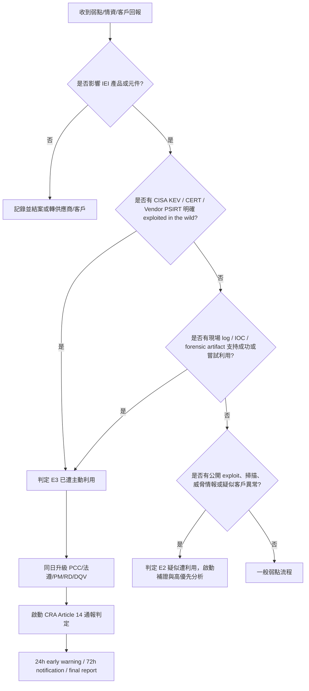

以下是建議可放入 IEI PSIRT SOP 的「已遭主動利用弱點 Actively Exploited Vulnerability」認定標準。你目前文件第 4.3 已寫成「已有可信證據顯示弱點正遭惡意利用」，方向正確；建議再補強「可靠證據」「惡意行為者」「未經系統擁有者許可」「實際系統被利用」四個判定要素，並與 CRA 通報流程連動。

## 1. 可採用的標準定義

建議定義如下：

> **已遭主動利用弱點 Actively Exploited Vulnerability**
> 指已有可靠證據顯示，惡意行為者已在未經系統擁有者許可之情況下，於實際系統中利用該弱點。此類案件應視為高優先級產品安全事件，並依 CRA Article 14 判定是否啟動強制通報程序。

這個版本比原本「正遭惡意利用」更貼近 CRA 的法規語意。CRA Article 3(42) 對 actively exploited vulnerability 的核心定義是：有可靠證據顯示惡意行為者已在未經系統擁有者許可的系統中利用該弱點。([歐洲法規查詢][1])

## 2. 官方與業界可參考標準

| 來源                                          | 可採用重點                                                                                                                                                                            | 對 PSIRT SOP 的意義                                                         |
| ------------------------------------------- | -------------------------------------------------------------------------------------------------------------------------------------------------------------------------------- | ----------------------------------------------------------------------- |
| **EU CRA / ENISA SRP**                      | CRA SRP 用於通報 actively exploited vulnerabilities 與 severe incidents；自 2026-09-11 起，製造商須透過 SRP 通報。ENISA FAQ 說明 actively exploited vulnerabilities 是「已知正被惡意行為者利用」的產品弱點。([ENISA][2]) | 作為法遵觸發條件。只要符合可靠證據門檻，應進入 CRA 強制通報判定。                                     |
| **CISA KEV**                                | CISA KEV 收錄條件包含：已有 CVE、具清楚修補/緩解指引、且有可靠證據顯示 active exploitation。([CISA][3])                                                                                                       | 可作為「外部可信證據」來源。若 CVE 已列入 KEV，PSIRT 原則上可直接判定為已遭利用。                        |
| **Microsoft MSRC Exploitability Index**     | Microsoft 將 Exploitation Detected 定義為已知有該弱點被利用的 instance，並要求客戶視為最高優先處理。其評估依據包含目前利用趨勢、telemetry、弱點類型歷史利用情況、以及 exploit 建置成本與可靠度。([Microsoft][4])                                   | 可借鏡為內部分級：Confirmed Exploitation、More Likely、Less Likely、Unlikely。       |
| **Google Threat Intelligence / VirusTotal** | Google Threat Intelligence 將 Exploited in the Wild 視為最關鍵指標，代表 real-world attacks 正在利用該弱點；Exploitation State = Confirmed 則表示有成功利用證據。([Google Threat Intelligence][5])             | 可作為威脅情報佐證來源，尤其是 Google TAG、Mandiant、VirusTotal、Android/Chrome bulletin。 |
| **Cisco PSIRT**                             | Cisco advisory 會明確標示「Cisco PSIRT became aware of active exploitation」或「attempted exploitation in the wild」。([Cisco][6])                                                          | 可作為 vendor advisory 類證據；若上游/同元件產品已遭利用，應啟動產品影響分析。                        |
| **Synology Product Security Advisory**      | Synology 一般政策是不在修補可用前公開弱點細節；公告中若註明「being exploited in the wild」，代表其已納入公告風險敘述。([Synology][7])                                                                                     | 可參考其揭露口徑：避免過早揭露 exploit 細節，但在必要時明確標示 in-the-wild exploitation。          |
| **FIRST EPSS / CVSS v4 Threat Metrics**     | EPSS 是預測未來 30 天被利用機率，不等於已遭利用；CVSS v4 Exploit Maturity 則可描述 exploit code、攻擊狀態或 in-the-wild exploitation。([FIRST][8])                                                              | 適合用於「疑似/高可能遭利用」輔助排序，不應單獨作為 CRA actively exploited 判定依據。                 |

## 3. PSIRT 可執行 SOP：判定等級

建議把案件分成四級，避免把「有 PoC」「可能被利用」「已遭利用」混在一起。

| 等級     | 名稱                                   | 判定條件                                                                                        | CRA 通報建議                             |
| ------ | ------------------------------------ | ------------------------------------------------------------------------------------------- | ------------------------------------ |
| **E0** | 未見利用跡象                               | 僅有弱點通報、掃描結果、內部測試或 researcher PoC，無實際攻擊證據                                                    | 不觸發；依一般弱點流程                          |
| **E1** | 有公開 exploit / 可武器化                   | Exploit code、PoC、Metasploit、GitHub exploit、技術細節公開，但尚無實際攻擊證據                                 | 不直接觸發；提高優先級                          |
| **E2** | 疑似遭利用                                | 客戶環境出現 IOC、log pattern、異常連線、掃描與攻擊嘗試，或 threat intel 顯示攻擊活動，但尚未能確認成功利用                        | 啟動 CRA 預判與法遵會商；不宜立即排除                |
| **E3** | 已遭主動利用 Confirmed Active Exploitation | 有可靠證據顯示惡意行為者已成功或實際嘗試利用該弱點於未授權系統；或 CISA KEV / vendor PSIRT / CERT 明確標示 exploited in the wild | 啟動 CRA Article 14 強制通報判定與 24/72 小時計時 |

## 4. 「可靠證據」建議清單

PSIRT 可接受下列任一類證據作為 E3 判定依據；若只有單一弱訊號，先列 E2，要求補證。

### A. 強證據，可直接判定 E3

1. **CISA KEV 收錄**：該 CVE 已被 CISA 加入 Known Exploited Vulnerabilities Catalog。
2. **上游或原廠 PSIRT 公告**：例如 Cisco、Microsoft、Google、Synology 等明確寫出 active exploitation、exploited in the wild、exploitation detected。
3. **CERT/CSIRT 官方通報**：國家 CERT、產業 ISAC、ENISA、CISA、JPCERT/CC 等明確指出利用活動。
4. **客戶或現場鑑識證據**：log、封包、EDR/XDR 告警、webshell、惡意 payload、異常帳號建立、命令執行紀錄與弱點 exploitation chain 對得上。
5. **攻擊者基礎設施或 IOC 對應**：C2、IP、domain、hash、YARA/Sigma rule 與該弱點利用活動高度吻合。

### B. 中等證據，通常判定 E2，經確認後升 E3

1. 網路上出現大量掃描或攻擊嘗試，但未確認成功利用。
2. Threat intelligence vendor 報告「likely exploited」但未揭露可驗證細節。
3. 客戶回報異常，但尚無 log 或 forensic artifact。
4. 公開 PoC 出現後，產品 telemetry 顯示異常 request pattern 增加。
5. Honeypot 觀察到利用嘗試，但尚未證明影響 IEI 產品版本。

### C. 不足以單獨判定 E3

1. 僅有 CVSS Critical / High。
2. 僅有 EPSS 高分。
3. 僅有公開 PoC 或 exploit code。
4. 僅有社群媒體傳言。
5. 僅有掃描器命中，但沒有利用證據。
6. Pwn2Own 或研究員展示成功 exploit，但無 in-the-wild 惡意利用證據；這通常是 E1 或 E2，而非 E3。

## 5. 建議放入 SOP 的判定流程

## 6. Jira 欄位建議

為了讓 SOP 可稽核，建議在 Jira 主案件加入以下欄位：

| 欄位                              | 建議值                                                                                                       |
| ------------------------------- | --------------------------------------------------------------------------------------------------------- |
| Exploitation Status             | E0 No Evidence / E1 Public Exploit / E2 Suspected / E3 Confirmed                                          |
| Evidence Source                 | CISA KEV / Vendor Advisory / CERT / Customer Log / Threat Intel / Internal Telemetry / Researcher / Other |
| Evidence Confidence             | Low / Medium / High                                                                                       |
| Evidence Summary                | 摘要說明，不放過度敏感 exploit 細節                                                                                    |
| Evidence Attachment             | log、截圖、advisory link、IOC、forensic report                                                                  |
| CRA Trigger Candidate           | Yes / No / Under Review                                                                                   |
| CRA Awareness Time              | PSIRT 首次具備可靠證據之時間                                                                                         |
| Legal/Compliance Review         | Pending / Completed / Not Required                                                                        |
| PCC Decision                    | Report / Do Not Report / Monitor / Need More Evidence                                                     |
| External Disclosure Restriction | Normal / Delay Details / Coordinated Disclosure / NDA Required                                            |

你目前 L2 文件已要求 Jira 記錄「是否疑似遭利用、是否可能涉及 CRA」以及 CRA 通報 24/72 小時節點；建議在 7.1、7.3、7.8 之間再補一個「Exploitation Status 判定」子章，讓 4.3 的名詞定義可以落地執行。 

## 7. 可直接貼入文件的 SOP 條文

### 4.3 已遭主動利用弱點 Actively Exploited Vulnerability

指已有可靠證據顯示，惡意行為者已在未經系統擁有者許可之情況下，於實際系統中利用該弱點。可靠證據可來自官方機構、上游供應商、PSIRT/CERT/CSIRT、CISA KEV、客戶現場鑑識資料、產品遙測、攻擊 IOC、EDR/XDR 告警、封包或系統日誌等。單純 CVSS 高分、EPSS 高分、公開 PoC、研究員展示或網路傳言，不得單獨視為已遭主動利用，但應作為疑似遭利用或高優先處理之風險訊號。

### 7.x 已遭利用狀態判定 Exploitation Status Determination

PSIRT 應於弱點受理、驗證與影響分析階段，判定案件之利用狀態：

* **E0 No Evidence**：未見利用證據。
* **E1 Public Exploit Available**：已有公開 PoC、exploit code 或可武器化技術細節，但未見實際利用證據。
* **E2 Suspected Exploitation**：存在疑似利用跡象，例如攻擊嘗試、掃描、客戶異常、IOC 或威脅情報，但尚未達可靠證據門檻。
* **E3 Confirmed Active Exploitation**：已有可靠證據顯示惡意行為者已實際利用該弱點，或該弱點已被 CISA KEV、官方 CERT/CSIRT、上游供應商或可信 PSIRT 公告為 exploited in the wild / exploitation detected / active exploitation。

凡判定為 **E3** 者，PSIRT 應於同日升級 PCC、法遵/法務、PM、RD 與 DQV/QA，並啟動 CRA Article 14 強制通報判定。若判定為 **E2**，PSIRT 應要求補充證據、啟動 threat intelligence 查核，並視風險先行規劃 workaround、客戶通知與修補排程。

## 8. 總結

建議 IEI PSIRT 採用 CRA 的法規定義作為主軸，再用 CISA KEV、Microsoft Exploitability Index、Google Threat Intelligence、Cisco/Synology advisory 慣例作為 operational evidence model。最重要的分界是：

**公開 PoC / 高 EPSS / 高 CVSS ≠ 已遭主動利用。**
**有可靠證據顯示惡意行為者已在未授權實際系統中利用弱點 = 已遭主動利用。**

[1]: https://eur-lex.europa.eu/legal-content/FR-EN/TXT/?from=FR&uri=CELEX%3A32024R2847&utm_source=chatgpt.com "Règlement - 2024/2847 - EN - EUR-Lex"
[2]: https://www.enisa.europa.eu/topics/product-security-and-certification/single-reporting-platform-srp "Single Reporting Platform (SRP) | ENISA"
[3]: https://www.cisa.gov/news-events/directives/bod-22-01-reducing-significant-risk-known-exploited-vulnerabilities?utm_source=chatgpt.com "BOD 22-01: Reducing the Significant Risk of Known ..."
[4]: https://www.microsoft.com/en-us/msrc/exploitability-index "exploitability-index"
[5]: https://gtidocs.virustotal.com/docs/vulnerability-report "Vulnerability report details"
[6]: https://sec.cloudapps.cisco.com/security/center/content/CiscoSecurityAdvisory/cisco-sa-sdwan-authbp-qwCX8D4v?utm_source=chatgpt.com "Cisco Catalyst SD-WAN Vulnerabilities"
[7]: https://www.synology.com/en-global/security/advisory "Synology Product Security Advisory | Synology Inc."
[8]: https://www.first.org/epss/model?utm_source=chatgpt.com "The EPSS Model"
